# Text to Robot

Describe a robot, inspect its generated 3D model, and download URDF/Xacro, ROS 2,
CAD and training packages. The service is free and self-hostable. It generates
robot concepts; it does not yet produce manufacturing-qualified machines from text.

A local prompt parser selects and parameterises our robot designs. Deterministic
TypeScript produces geometry and robot files. Python handles MuJoCo,
learning, collision decomposition and CadQuery solid CAD.

## Run the service

Requires Node.js 22.6 or newer; Python 3.10+ is needed for simulation/CAD.

```bash
git clone https://github.com/megazron/text-to-robot
cd text-to-robot
npm install
npm run api
# Open http://localhost:8787
```

Generation, modification and exports run on your own host. No sign-in, API key,
model token, inference provider or browser CDN is used. The viewer supports joint
controls, JSON import, modification,
version history, share links and downloads. To host the service, use
`docker compose up`; configure persistent storage for generated robots.
Simulation and learning run on the user's machine. Hosted GPU training is not
provided by the web service.

```bash
node cli/src/index.ts "Create a 6 DOF robotic arm with a parallel gripper"
node cli/src/index.ts validate examples/14_iron_man_mark_43/robot.urdf
```

Templates include arms, grippers, wheeled robots, legged robots and character
concepts. See [examples](examples/) and [architecture](docs/ARCHITECTURE.md).

## Free web service and researched designs

Run `docker compose up --build` to serve the website with persistent robot storage.
Three.js is bundled during installation and served locally, including on shared
robot links. User requests make no third-party network calls. Hosting still needs
a machine; this repository does not provision a public server or free GPU compute.
The parser supports the listed robot families and dimensional modifications; it
rejects unrecognised requests instead of returning an unrelated arm.

[Public engineering research and model changes](references/engineering/README.md)
record the sources, deductions and remaining gaps. All product geometry is
created by our own parametric generators. Hugging Face is not a runtime or asset
supplier for the web service, and no cloud inference adapter is included.

Recent changes include hollow sheet chassis with mounting bores and removable
vented lids; corrected planar/6-axis arm layouts and visible joint hubs; closing gripper pads; ground
contact feet; six-axis humanoid legs; a physically supported EVA; a revised Mark 43 faceplate
pivot; and true passive mecanum rollers. Wheel motors use velocity commands
in MuJoCo, PyBullet and ROS configuration. Training samples reachable targets,
observes base attitude/velocity, and scores actual motion instead of action values.

[Measured wheel motion](examples/mobile_motion.json) includes forward driving and
mecanum sideways motion produced by contacts, without external force injection.
These are limited simulation tests, not a physical prototype certification.

[Browser validation](examples/web_validation.json) covers all 17 examples with
third-party requests blocked. Inspect the actual viewer captures:
[arm](docs/img/web/02_arm_6dof.png), [mecanum](docs/img/web/07_mecanum.png),
[Mark 43](docs/img/web/14_iron_man_mark_43.png), [EVA](docs/img/web/16_eva.png).

The viewer now waits for the actual mesh geometry before marking the preview
ready, reports failed parts and offers retry. Browser validation compares rendered
triangle counts with the served STL files instead of only checking HTTP success.

Serial-arm link blanks now extend continuously between pivots, with narrowed
ends and compound collision cylinders. These remain provisional link blanks;
bearings, transmissions and component interfaces are not yet qualified.

Four [coordinated arm motion demos](examples/02_arm_6dof/#coordinated-motion) use
smooth commands and optional model-based bias-force compensation through the
original effort-limited actuators. Their reports and GIFs show the specific tested
paths; separate stress-sweep failures remain visible. The six-axis arm and SCARA
[training smoke checks](examples/arm_training_smoke.json) include Gymnasium checks,
64 PPO steps and checkpoint reload, without claiming a learned task.

## Current examples and animations

[Browse all 17 examples, their GIFs, MoveIt files and simulation results](examples/README.md).
Every example now has a dedicated README and downloadable ROS package.
All 17 models load in both physics engines. ROS exports include the revised joint
and wheel controller configuration; see the recorded build validation.
All 17 have no initial inter-body penetration above 1 mm in the current audit
(primitives and mesh proxies for the other examples; compound hulls for Mark 43). Motion tracking and balance failures remain documented.
The [runtime record](examples/runtime_validation.json) separates these checks.
All 17 [training exports](examples/training_validation.json) reset and take a finite
PyBullet step. These checks establish that the exported environments run; they
do not establish learned skills or model-to-hardware accuracy.

Corrections include outward-facing humanoid grippers, downward spider shins,
SCARA base clearance, Baymax capsule lengths and arm spacing, continuous wheel
limits, and distinct MoveIt groups for arms and legs. Training uses named tool
links, sampled reachable targets and an aperture task for standalone grippers.

<!-- EXAMPLE_GALLERY_START -->

These are actual simulations of all 17 exported examples. Check counts are smoke-test results; no example has a documented physical prototype. Click **Build evidence** for the missing manufacturing and hardware work.

| | | |
|---|---|---|
| [**arm 2dof**](examples/01_arm_2dof/)<br>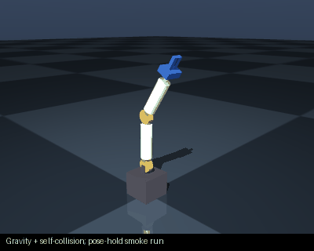<br>4/5 simulation checks · [CAD](examples/01_arm_2dof/robot.cad.zip) · [Results](examples/01_arm_2dof/simulation_report.json) · [Build evidence](examples/01_arm_2dof/BUILDABILITY.md) | [**arm 6dof**](examples/02_arm_6dof/)<br>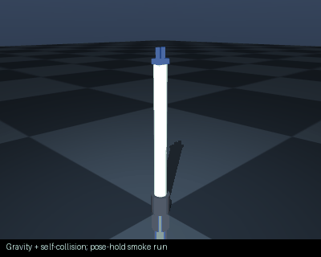<br>4/5 simulation checks · [CAD](examples/02_arm_6dof/robot.cad.zip) · [Results](examples/02_arm_6dof/simulation_report.json) · [Build evidence](examples/02_arm_6dof/BUILDABILITY.md) | [**arm 7dof**](examples/03_arm_7dof/)<br>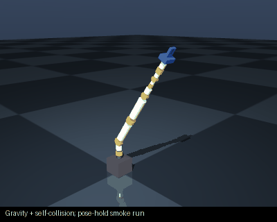<br>4/5 simulation checks · [CAD](examples/03_arm_7dof/robot.cad.zip) · [Results](examples/03_arm_7dof/simulation_report.json) · [Build evidence](examples/03_arm_7dof/BUILDABILITY.md) |
| [**scara**](examples/04_scara/)<br>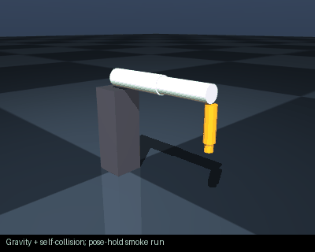<br>4/5 simulation checks · [CAD](examples/04_scara/robot.cad.zip) · [Results](examples/04_scara/simulation_report.json) · [Build evidence](examples/04_scara/BUILDABILITY.md) | [**diff drive**](examples/05_diff_drive/)<br>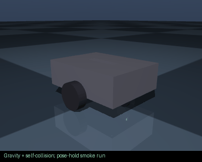<br>5/6 simulation checks · [CAD](examples/05_diff_drive/robot.cad.zip) · [Results](examples/05_diff_drive/simulation_report.json) · [Build evidence](examples/05_diff_drive/BUILDABILITY.md) | [**four wheel**](examples/06_four_wheel/)<br><br>5/6 simulation checks · [CAD](examples/06_four_wheel/robot.cad.zip) · [Results](examples/06_four_wheel/simulation_report.json) · [Build evidence](examples/06_four_wheel/BUILDABILITY.md) |
| [**mecanum**](examples/07_mecanum/)<br>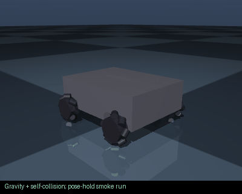<br>5/6 simulation checks · [CAD](examples/07_mecanum/robot.cad.zip) · [Results](examples/07_mecanum/simulation_report.json) · [Build evidence](examples/07_mecanum/BUILDABILITY.md) | [**humanoid**](examples/08_humanoid/)<br>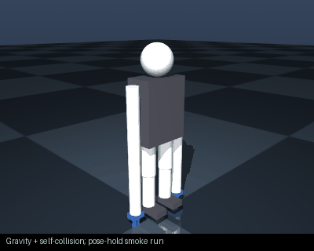<br>4/6 simulation checks · [CAD](examples/08_humanoid/robot.cad.zip) · [Results](examples/08_humanoid/simulation_report.json) · [Build evidence](examples/08_humanoid/BUILDABILITY.md) | [**gripper**](examples/09_gripper/)<br><br>5/5 simulation checks · [CAD](examples/09_gripper/robot.cad.zip) · [Results](examples/09_gripper/simulation_report.json) · [Build evidence](examples/09_gripper/BUILDABILITY.md) |
| [**quadruped**](examples/10_quadruped/)<br>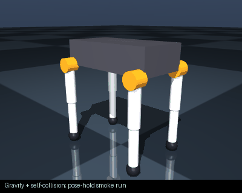<br>5/6 simulation checks · [CAD](examples/10_quadruped/robot.cad.zip) · [Results](examples/10_quadruped/simulation_report.json) · [Build evidence](examples/10_quadruped/BUILDABILITY.md) | [**spider scout**](examples/11_spider_scout/)<br>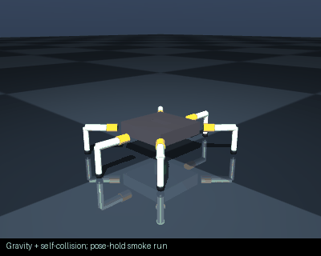<br>6/6 simulation checks · [CAD](examples/11_spider_scout/robot.cad.zip) · [Results](examples/11_spider_scout/simulation_report.json) · [Build evidence](examples/11_spider_scout/BUILDABILITY.md) | [**mars rover**](examples/12_mars_rover/)<br>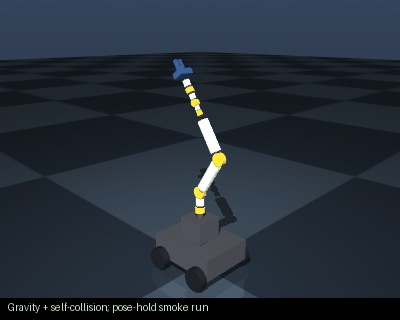<br>5/6 simulation checks · [CAD](examples/12_mars_rover/robot.cad.zip) · [Results](examples/12_mars_rover/simulation_report.json) · [Build evidence](examples/12_mars_rover/BUILDABILITY.md) |
| [**battle mech**](examples/13_battle_mech/)<br><br>4/6 simulation checks · [CAD](examples/13_battle_mech/robot.cad.zip) · [Results](examples/13_battle_mech/simulation_report.json) · [Build evidence](examples/13_battle_mech/BUILDABILITY.md) | [**iron man mark 43**](examples/14_iron_man_mark_43/)<br><br>4/6 simulation checks · [CAD](examples/14_iron_man_mark_43/robot.cad.zip) · [Results](examples/14_iron_man_mark_43/simulation_report.json) · [Build evidence](examples/14_iron_man_mark_43/BUILDABILITY.md) | [**wall e**](examples/15_wall_e/)<br>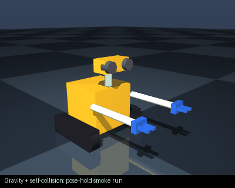<br>5/6 simulation checks · [CAD](examples/15_wall_e/robot.cad.zip) · [Results](examples/15_wall_e/simulation_report.json) · [Build evidence](examples/15_wall_e/BUILDABILITY.md) |
| [**eva**](examples/16_eva/)<br>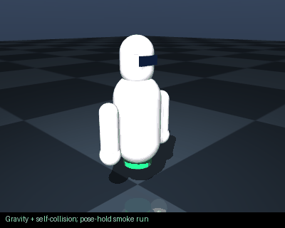<br>5/6 simulation checks · [CAD](examples/16_eva/robot.cad.zip) · [Results](examples/16_eva/simulation_report.json) · [Build evidence](examples/16_eva/BUILDABILITY.md) | [**baymax**](examples/17_baymax/)<br>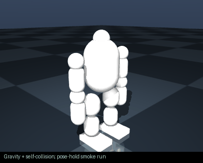<br>4/6 simulation checks · [CAD](examples/17_baymax/robot.cad.zip) · [Results](examples/17_baymax/simulation_report.json) · [Build evidence](examples/17_baymax/BUILDABILITY.md) |  |

<!-- EXAMPLE_GALLERY_END -->

## Iron Man: MoveIt and animated previews


These are fresh actuator previews of the exported geometry, using a fixed base
and self-collision disabled. They show articulation, not validated human entry.
The [Iron Man example README](examples/14_iron_man_mark_43/README.md) also shows the
collision-enabled physics GIF and exact failures.

**MoveIt:** [browse the SRDF, planning and controller configuration](examples/14_iron_man_mark_43/moveit/),
[download the ROS package](examples/14_iron_man_mark_43/robot.ros2.zip), and follow the
[launch instructions](examples/14_iron_man_mark_43/README.md#moveit--ros-2).
The suit now has a collision-free neutral state. Small neck and left/right arm
goals plan and execute through mock control. One right-arm request timed out
before a successful retry; both records are retained in the example. Full-range
motion and real hardware remain unqualified.

[Internet research and downloaded design inspection](references/mark43/RESEARCH.md)
now supplement the saved production photographs.

## Mark 43: current model and actual limits


The current model contains **268 links, 232 mesh instances using 216 unique STL
files and 86 actuated joints**. Each finger has three articulated segments, each
thumb has two, and the helmet has neck yaw and pitch. Chest inlays follow their
opening doors. Thigh, shin and arm trim now follows the underlying shell surface.
Fixed trim moves with its supporting plate; it does not need an independent motor.


These close-ups prescribe joint positions on the actual exported meshes with
collisions disabled. They demonstrate articulation, not safe motion or qualified
mechanisms. [Joint-motion evidence](examples/14_iron_man_mark_43/articulation_report.json).

Comparison now includes [Legacy Effects' Avengers: Age of Ultron production
references](https://www.legacyefx.com/avengersaou), alongside the licensed collectible
reference used previously. The [visual review](docs/MARK43_VISUAL_REVIEW.md) compares
specific shapes and shows front/rear views. **This is not movie-accurate yet.**
Chest continuity, helmet topology, rib placement, hand anatomy and exposed drive
modules remain conspicuous differences. No visual accuracy percentage is claimed. Reference photographs are now cached
locally and checked against saved iterations; see the [reference workflow](references/mark43/README.md).

| Check | Current evidence |
|---|---|
| Closed mesh topology and mass integrals | 232/232 mesh instances pass |
| Empty-suit smoke battery, self-collision off | 3/5; tracking and disturbance recovery fail |
| Suit with passive mannequin, human/self-contact disabled | See loaded physics report; actuator tracking still fails |
| Compound-convex initial collision | Zero initial contacts; this does not establish full-range or human clearance |
| Collision-enabled suit smoke battery, compound model | 4/6; actuator tracking and disturbance recovery fail |
| Joint-range clearance | See regenerated motion-clearance report; interference remains |
| ROS 2 Jazzy / MoveIt | Zero neutral contacts; small neck and both arm goals plan and execute using mock control |
| Six-axis arm MoveIt fixture | Planning and mock trajectory execution pass |
| Wearer fit | Example measurements fail opening/clearance checks |
| Breathing, structural strength, real hardware | Unverified |

The current revision reduces neutral surface intersections from **81 to 0** and
native MoveIt contacts from **85 to 0**. It separates helmet seams, adds the red
forehead insert, reshapes the shoulders and boots, cuts limb-shell rims around the
motor housings, and attaches rear details to their opening flaps. These changes
are actual exported geometry, not altered renderings.
[Before/after evidence](examples/14_iron_man_mark_43/surface_contact_comparison.json).

The 428-pose surface audit of seven selected joints now passes, together with
[a 962-pose combined neck yaw/pitch check](examples/14_iron_man_mark_43/neck_motion_report.json).
The helmet shroud follows yaw; the fixed neck ring and collar have pitch clearance.
Eight clamshell hinges now open away from their own cuffs over the original travel.
Large openings still hit neighbouring body parts in the standing pose.

The [full surface audit](examples/14_iron_man_mark_43/all_joint_surface_report.json)
checks every one of the 86 limited joints: **295 moving samples fail out of 1,119
poses including neutral**. The [example README](examples/14_iron_man_mark_43/README.md)
reports **159/775 failing compound-collision poses**, including increased
neighbouring-body interference with the corrected clamshell directions. These failures, the closed
head/hip entry restrictions, and unverified hardware interfaces remain release
blockers. The proportions and visible mechanics still differ from the film.

| Previous exported geometry | Current exported geometry |
|---|---|
| 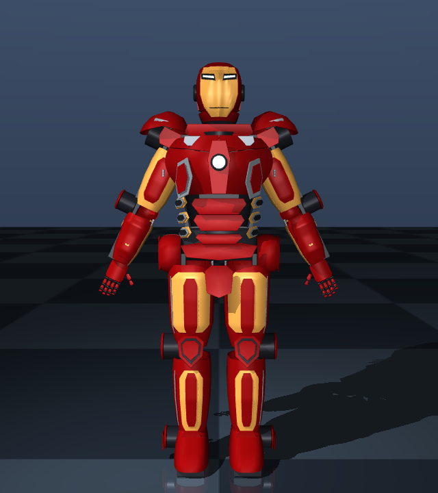 |  |

Reports and downloadable files:

- [ROS 2 package](examples/14_iron_man_mark_43/robot.ros2.zip), [training package](examples/14_iron_man_mark_43/robot.training.zip), [CAD package](examples/14_iron_man_mark_43/robot.cad.zip).
- [Compound-convex MuJoCo/URDF model](examples/14_iron_man_mark_43/robot.convex.zip).
- [Physics](examples/14_iron_man_mark_43/mujoco_report.json), [loaded physics](examples/14_iron_man_mark_43/mujoco_report_wearer.json), [collision](examples/14_iron_man_mark_43/clearance_report.json), [motion clearance](examples/14_iron_man_mark_43/motion_clearance_report.json).
- [Wearability](examples/14_iron_man_mark_43/wearability_report.json), [suit MoveIt](examples/14_iron_man_mark_43/moveit_report.json), [arm MoveIt fixture](examples/14_iron_man_mark_43/moveit_fixture_report.json), [preliminary BOM](examples/14_iron_man_mark_43/BOM.md).

### Entry and breathing


Opening the panels does not establish that a person can enter. The current closed
pelvis and neck openings fail straight-insertion checks against the illustrative
wearer dimensions. Static human-contact checks also find interference in both open
and closed poses. These are proxy checks, not a continuous donning path or tissue
model. Measurements, separable frame interfaces, joint alignment and a manual
release system still need design and validation.

Decorative grilles and eye apertures do not establish breathable space. There is
no measured airflow, CO₂, temperature, fan-duct design or emergency breathing
assessment. The wearer report explicitly leaves these unresolved.

## Physical replication status

**No example has a documented, tested physical build.** Each gallery entry links
to its BOM, downloadable CAD and a source-hashed build-evidence inventory. These
identify missing motor interfaces, bearings, electronics mounting, wiring,
tolerances, assembly instructions and measured dynamics. A simulation pass does
not fill those gaps. The CAD files are concept geometry, not complete assembly kits.

The component selector now excludes limited-angle hobby servos from continuous
wheel joints, and reports linear forces in newtons rather than torque units.
That corrects two concrete errors; actuator speed, thermal duty, voltage, feedback
and physical fit still require verification against the selected hardware.

To reproduce the exported results from the checked-in specifications:

```bash
node scripts/export_examples.ts
python scripts/audit_examples.py
python scripts/render_example_gifs.py
python scripts/check_training_exports.py
python scripts/document_examples.py
python scripts/verify_example_artifacts.py
```

Use the Python environment described below. The scripts reject a stale compound
collision archive; after changing Mark 43 geometry, regenerate it with
`python scripts/audit_mark43.py --convex` before running the example audit.

## ROS 2 and MoveIt

Before sending a proposed joint path to a controller, you can inspect sampled
surface intersections locally with no API or token:

```bash
python scripts/audit_motion_path.py examples/14_iron_man_mark_43/robot.sim.urdf \
  docs/motion_paths/mark43_chest_neck.json --json /tmp/path-report.json
python scripts/check_motion_paths.py --check
```

Waypoints specify joint positions in radians/metres. The checker interpolates
all named joints together at steps of at most 0.02 rad / 2 mm and records the
exact failing pose and link pairs. It rejects unknown joints, invalid limits,
nonfinite inputs and excessive work. Exit status is 0 for clear samples, 1 for
intersections, and 2 for invalid input. This is sampled geometry checking;
it does not establish continuous clearance or safe physical operation.

[Six reproducible paths and their results](docs/motion_paths/README.md)
cover the four arm examples and Mark 43 chest/neck and knee motion. The combined
chest/neck path clears 121 samples; the knee path has intersections at 45 of 51.
The arm reports retain existing assembly contacts, even where the separate
MuJoCo task-motion test passes. These checks have different collision geometry
and exclusions; neither is hardware validation.

The ROS download includes an `ament_cmake` package, URDF/Xacro, meshes, RViz,
`ros2_control`, SRDF, joint limits, KDL and OMPL configuration. Wearables have
separate arm, leg, hand, torso and armour groups. Underactuated chains use
position-only IK; arbitrary six-dimensional targets may be unreachable.

```bash
# Unzip the ROS package into a ROS 2 Jazzy workspace's src directory.
source /opt/ros/jazzy/setup.bash
rosdep install --from-paths src --ignore-src -r -y
colcon build
source install/setup.bash
ros2 launch iron_man_mark_43 move_group.launch.py
# Add rviz:=false for headless execution.
```

MoveIt uses actual mesh triangles for collision geometry, retaining hollow parts.
Only adjacent links are automatically excluded. The launch runs
`mock_components/GenericSystem`: it validates ROS control/planning wiring, not
real motors or MuJoCo dynamics. The native start-state check, planning result and mock execution are recorded
separately. Collision checking remains enabled; broader range-of-motion tests
still expose interference.
The six-axis arm fixture was built, planned and executed through mock control on
ROS 2 Jazzy. Gazebo export is also available; it has not received the same runtime
validation in this revision.

## Physics and training

```bash
python -m venv .venv
source .venv/bin/activate
pip install -e './python[geometry,train]'
ttr-mujoco test examples/14_iron_man_mark_43/robot.sim.urdf --self-collision
# For training, unzip robot.convex.zip and use its collision-prepared model.
ttr-mujoco train path/to/robot.urdf --task stand --self-collision --steps 400000
# An arm reaching task must name the actual tool body:
ttr-mujoco train path/to/arm.urdf --task reach --tip-body gripper_base --self-collision
```

Training downloads bundle the Python MuJoCo runtime and requirements, alongside
PyBullet/Gymnasium training and evaluation scripts. PyBullet environments have
independent clients and use per-joint force/velocity limits. MuJoCo reaching
requires an explicit tool body. Invalid actions are rejected and numerical
failures terminate unsuccessfully.

A six-axis arm passed Gymnasium checks in both engines and a 64-step PPO
checkpoint smoke run. This proves the training pipeline starts and saves; it does
not establish a capable policy or a trained wearable. Self-collision is opt-in in
the converter, so enable it explicitly when assessing physical behavior.

Mesh mass properties come from closed-solid volume integrals. MuJoCo preserves
COM, rotated/full inertia tensors, collision offsets and per-joint effort limits.
Tracking checks use trajectory RMS error. Servo gains, friction and motor dynamics
remain approximate; torque-speed, heat, power draw, compliance and backlash are
not calibrated. A passing smoke test is not evidence of sim-to-real accuracy.

## CAD and real components

CAD downloads contain STL, parametric OpenSCAD and the Python CadQuery enclosure
backend. Dimensioned board manifests can produce STEP base/lid solids, standoffs
and openings. The attachment workflow embeds their meshes and mass properties in
robot JSON for import into the viewer. See [physical fidelity](docs/PHYSICAL_FIDELITY.md)
and [Python instructions](python/README.md).

The BOM is preliminary. CubeMars AK80-64 selection now uses the manufacturer's
48 Nm rated torque rather than 120 Nm peak torque. A hypothetical custom actuator
is excluded from automatic selection. Budget fit, torque sizing and verified
hardware are separate outcomes. Real mounting drawings, bearings, transmissions,
connectors, cable clearances, power/thermal design and load tests remain necessary;
printing the armour does not supply these missing mechanisms.

## Reproduce and develop

```bash
npm test
npm run typecheck
pip install -e './python[cad,geometry]'
python -m unittest discover -s python/tests -v
node scripts/regen_mark43_example.ts
python scripts/audit_mark43.py --convex
python scripts/check_mesh_assets.py --json examples/14_iron_man_mark_43/mesh_quality_report.json
python scripts/render_mark43_review.py
node scripts/export_mark43_packages.ts /tmp/ttr-mark43-packages
```

Regeneration invalidates reports and download bundles tied to old geometry.
Software regressions and mesh checks gate CI; failing concept physics remains
visible in diagnostic reports. Next engineering milestones are continuous
reference-based armour surfaces, collision-free mechanisms, measured wearer fit,
qualified component interfaces and hardware-calibrated dynamics. They are not
implemented merely because they appear in a roadmap.

Code is MIT licensed; see [LICENSE](LICENSE). Character references and associated
intellectual property belong to their respective owners.
