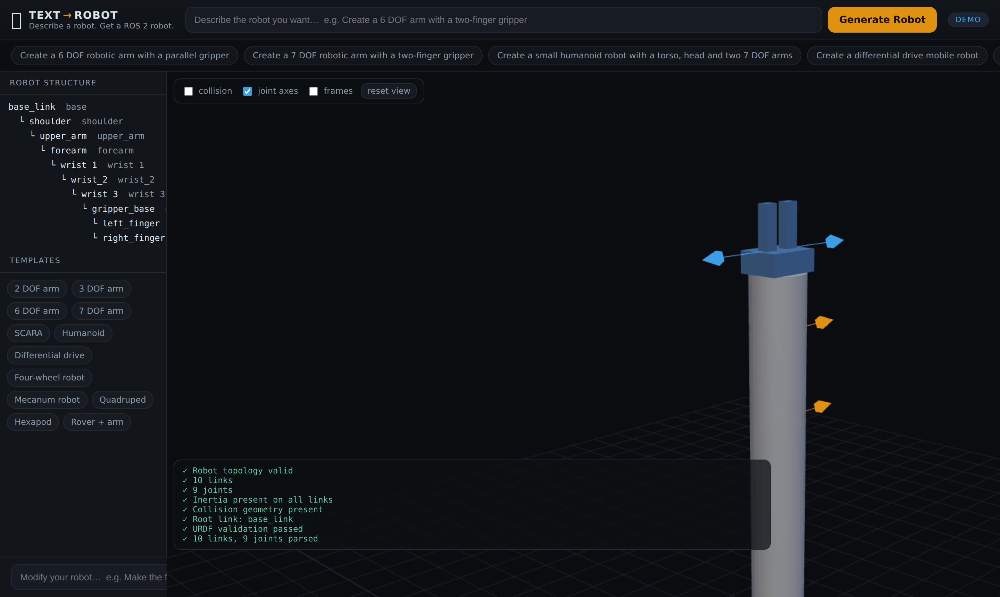
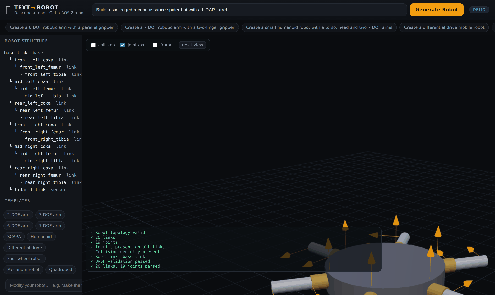
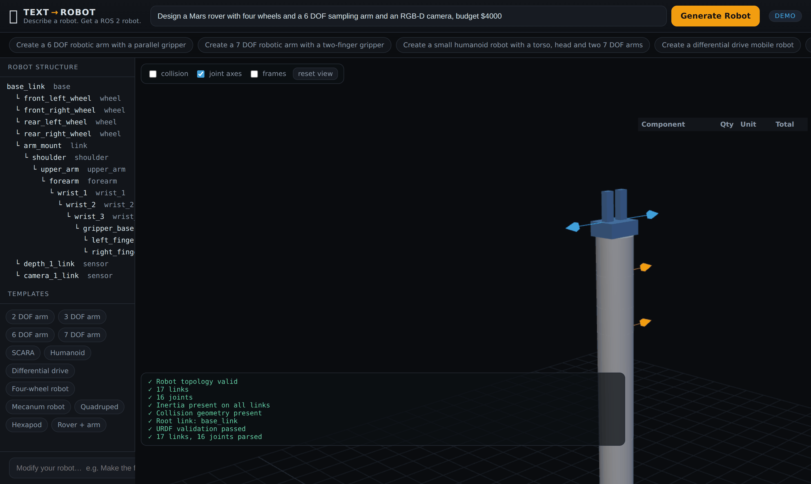

# 🤖 Text&nbsp;to&nbsp;Robot

### «Describe a robot. Get a ROS&nbsp;2 robot.»

Text-to-speech turns words into audio. **Text-to-Robot turns words into a robot** — a validated URDF/Xacro, an interactive 3D model, and a buildable ROS 2 package.

```
        TEXT                          ROBOT                         ROS 2
"Create a 6 DOF robotic     →   interactive 3D model,    →   URDF / Xacro +
 arm with a parallel             joints you can move          ament package you
 gripper."                        with sliders                 can colcon build
```

> The hard rule that makes this reliable: **the language model never writes URDF.**
> It only produces a typed `RobotSpecification`. Deterministic, tested code turns
> that into XML. See [Architecture](docs/ARCHITECTURE.md).

<p align="center"></p>

<p align="center">
  
  
</p>

<p align="center"><i>Every screenshot is the real app in demo mode — no API key. Left: a six-legged scout generated from a prompt. Right: a Mars rover with its live Bill of Materials.</i></p>

## Free & self-hostable

Text to Robot is **free and open-source**, and designed to run as a **free service**: clone it and `npm run api`, or deploy the same server anywhere. No API key is required — an offline deterministic engine powers everything, and optional OpenAI/Anthropic keys just improve open-ended prompts. The end goal: **describe a robot, download it, and immediately start training it** (see [Train your robot](#train-your-robot)).

---

## Why Text to Robot?

Writing URDF by hand is slow and error-prone: nested XML, inertia tensors, joint
limits, frame conventions. Asking an LLM to emit raw URDF is worse — it hallucinates
tags, invents inertias and breaks the kinematic tree. Text-to-Robot splits the
problem the right way:

- **The LLM does understanding** — turning "6 DOF arm with a gripper" into structure.
- **Deterministic code does generation** — inertia from geometry, validated topology,
  clean XML, every time.

The result is reproducible, testable, and works **with no API key at all** (deterministic
demo mode), so the repo runs the moment you clone it.

## Features

- 🗣️ **Natural-language generation** — arms, mobile bases, quadrupeds, humanoids, grippers.
- 🧱 **Typed RobotSpecification** — one strongly-typed IR for the whole pipeline.
- 🧮 **Automatic inertia** — box / cylinder / sphere / capsule tensors from geometry + mass.
- ✅ **Real validation** — single root, no cycles, unique names, valid limits, positive mass,
  physically-plausible inertia; plus a self-healing repair loop (max 3 attempts).
- 🧊 **Interactive 3D viewer** — Three.js, orbit/zoom/pan, click to inspect, **joint sliders**
  driven by forward kinematics — no ROS required in the browser.
- ✏️ **Natural-language modification** — "make the forearm 30% longer", "add a camera to the head",
  "replace the gripper with a suction gripper" — edits the existing spec, with a **git-style diff**.
- 🕑 **Version history** — every change is a version you can switch between.
- 📦 **ROS 2 export** — a complete `ament_cmake` package with `display.launch.py`, RViz config,
  joint limits, and optional `ros2_control`.
- 💸 **Bill of Materials to a budget** — picks *real* actuators (sized by the torque each joint
  must hold), sensors, compute, power and structure, and tells you what it costs and whether it
  fits your budget. So the robot can actually be built.
- 🛠️ **CAD parts** — parametric OpenSCAD for every link plus an assembly, ready to mesh to STL and print.
- 🏋️ **Train it** — a downloadable PyBullet + Gymnasium training suite (RL with PPO/SAC, imitation
  learning, demo collection, evaluation) that loads the generated robot directly.
- 🖥️ **CLI + HTTP API** — scriptable and embeddable.
- 🔌 **Pluggable LLMs** — OpenAI, Anthropic, or deterministic demo mode.

## Architecture

```
prompt → LLM (or demo parser) → RobotSpecification → validate → repair → inertia →
         URDF/Xacro → validate → 3D viewer + ROS 2 package
```

Full diagram and package map in [docs/ARCHITECTURE.md](docs/ARCHITECTURE.md).

## Supported robots

Templates (used as sensible starting points the AI can customize):

| | | |
|---|---|---|
| 2 / 3 / 6 / 7 DOF arms | SCARA | Parallel & two-finger grippers |
| Differential drive | Four-wheel | Mecanum |
| Quadruped | Hexapod (18 DOF) | Humanoid (torso, head, two arms) |
| Rover + arm (mobile manipulator) | Parallel & suction grippers | ...and anything a prompt implies |

Thirteen worked examples (including sci-fi builds) live in [`examples/`](examples/) — each passes schema **and** URDF validation.

## Installation

Requires **Node.js ≥ 22.6** (uses native TypeScript execution — no build step). No other runtime dependencies.

```bash
git clone https://github.com/megazron/text-to-robot
cd text-to-robot
npm install          # links the workspace packages (no third-party deps to download)
npm test             # 43 tests
```

## Quick start

**Web app (the full experience):**

```bash
npm run api
# open http://localhost:8787
```

Type a prompt, watch the robot appear, drag the joint sliders, then click **ROS 2 Package**.

**CLI:**

```bash
node cli/src/index.ts "Create a 6 DOF robotic arm with a parallel gripper"
# → ./arm_6dof/  (URDF, Xacro, launch, config, rviz, README, JSON)
```

## CLI

```bash
text-to-robot "<prompt>"                         # generate (bare prompt)
text-to-robot generate "<prompt>" -o out/        # generate into out/
text-to-robot modify robot.json "make it longer" # modify an existing spec
text-to-robot validate robot.urdf                # structural URDF validation
text-to-robot inspect robot.urdf                 # print links + joints
```

(Invoke with `node cli/src/index.ts ...`, or `npm link` the `cli` workspace to get the
`text-to-robot` binary on your PATH.)

## ROS 2

The exported package is a normal `ament_cmake` package:

```
my_robot/
├── package.xml
├── CMakeLists.txt
├── urdf/my_robot.urdf.xacro     # real Xacro: <xacro:macro> inertials
├── urdf/my_robot.urdf           # flattened URDF
├── launch/display.launch.py     # robot_state_publisher + joint_state_publisher_gui + rviz2
├── config/joint_limits.yaml
├── config/controllers.yaml      # optional ros2_control
├── rviz/my_robot.rviz
└── README.md
```

```bash
cp -r my_robot ~/ros2_ws/src/
cd ~/ros2_ws && colcon build --packages-select my_robot
source install/setup.bash
ros2 launch my_robot display.launch.py
```

## Real-world buildability (Bill of Materials)

A robot you can see is not a robot you can build. Text to Robot estimates the **real components**
needed and their cost, and fits them to a **budget** you give:

- **Actuators sized by physics** — for each joint it estimates the holding torque from the mass and
  reach of everything downstream, then picks a real actuator (hobby servo → Dynamixel → BLDC) with a
  1.5× margin.
- **Everything else** — sensors (cameras, LiDAR, IMU), compute (ESP32 → Raspberry Pi → Jetson),
  power (LiPo + regulator + distribution), structure (3D-printed or aluminium, from the total mass),
  and wiring.
- **Budget aware** — give a budget and it chooses the richest component tier that fits, or tells you
  honestly that it does not fit and by how much.

```bash
text-to-robot bom my_robot.json 800     # estimate a build at an $800 budget
```

Prices are planning estimates, not quotes. The output is a full table (`BOM.md`) plus a per-joint
actuator sizing table.

## CAD parts

Every link is emitted as a parametric **OpenSCAD** part, plus an assembly placed at the robot's zero
pose. Mesh any part (or the whole robot) to STL for printing:

```bash
openscad -o base_link.stl cad/parts/base_link.scad
openscad -o my_robot.stl  cad/my_robot.scad
```

## Train your robot

The vision: **describe a robot, download it, and start training it.** Each generated robot ships with
a `training/` suite backed by **PyBullet + Gymnasium** (which loads the URDF directly, with a motor
per joint). No ROS required.

```bash
cd training && pip install -r requirements.txt
python train_rl.py --task reach --algo ppo   # reinforcement learning (PPO or SAC)
python collect_demos.py --episodes 50        # scripted expert -> demos.npz
python train_bc.py                           # imitation learning (behaviour cloning)
python evaluate.py --task reach --rl <model> # success rate
```

Tasks are chosen from the robot's class (manipulator → reach/track/hold, mobile → drive/goto,
locomotion → walk/balance/turn) and are easy to extend in `tasks.py`. Classical motion planning is
available through the exported MoveIt 2 / ROS 2 package.

## AI architecture

`packages/llm-providers` defines a small `LlmProvider` interface with `generateSpec` and
`modifySpec`. Two cloud adapters (OpenAI, Anthropic) ask the model for a **JSON
RobotSpecification** — never XML — using a strict system prompt. If no `OPENAI_API_KEY` /
`ANTHROPIC_API_KEY` is set, the app uses a **deterministic demo parser** (keyword + regex)
so it always works offline. Cloud output is untrusted: it is JSON-parsed, coerced, then run
through the same validation + repair loop as everything else.

```bash
export ANTHROPIC_API_KEY=sk-...   # or OPENAI_API_KEY=...
npm run api                       # badge switches from "demo" to "cloud"
```

Keys are read only on the server and never sent to the browser.

## URDF generation

Deterministic, in `packages/urdf-generator`: `generateRobot`, `generateLink`, `generateJoint`,
`generateVisual`, `generateCollision`, `generateInertial`, `generateMaterial`, `generateLimits`.
The Xacro output uses real `<xacro:macro>` inertials computed with `${...}` expressions.
URDF has no capsule primitive, so capsules are emitted as cylinders (documented in the output).

## Validation

Every robot is checked for: exactly one root, no cycles, all parent/child links exist, one
parent per child, unique link/joint names, valid joint types and axes, valid limits, positive
masses and dimensions, and physically-plausible inertia (positive principal moments + triangle
inequality). Invalid specs enter a **repair loop** (drop dangling joints, de-duplicate names,
enforce a single root, fix limits/axes, clamp masses) for up to 3 attempts. Failures are shown,
never hidden. The tool validates **URDF structure**; it does not claim physical/dynamic validity.

## Examples

```bash
node cli/src/index.ts validate examples/02_arm_6dof/robot.urdf
```

| # | Example | Prompt |
|---|---|---|
| 1 | 2 DOF arm | `Create a 2 DOF robotic arm` |
| 2 | 6 DOF arm | `Create a 6 DOF robotic arm with a parallel gripper` |
| 3 | 7 DOF arm | `Create a 7 DOF robotic arm with a two-finger gripper` |
| 4 | SCARA | `Create a SCARA robot` |
| 5 | Differential drive | `Create a differential drive mobile robot` |
| 6 | Four-wheel | `Create a four-wheel robot` |
| 7 | Mecanum | `Create a mecanum-wheel robot` |
| 8 | Humanoid | `... torso, head and two 7 DOF arms and two-finger grippers` |
| 9 | Gripper | `Create a two-finger parallel gripper` |
| 10 | Quadruped | `Create a quadruped robot` |
| 11 | Spider scout | `Build a six-legged reconnaissance spider-bot with a LiDAR turret, budget $1500` |
| 12 | Mars rover | `Design a Mars rover with four wheels and a 6 DOF sampling arm, RGB-D camera, budget $4000` |
| 13 | Battle mech | `Create a humanoid battle mech with two 7 DOF arms, a head camera and an IMU` |

**Imagine anything.** Prompts route to the closest structure and pull in the sensors you mention:
"a warehouse loader with mecanum wheels and a suction gripper", "an insectoid recon drone with a
LiDAR", "a planetary explorer with a 1-metre arm". Each still passes schema + URDF validation.

## Development

```
text-to-robot/
├── apps/            web (Three.js viewer) + api (zero-dep HTTP server)
├── packages/        robot-schema, kinematics, robot-templates, urdf-generator,
│                    urdf-validator, llm-providers, robot-generator, ros2-export
├── cli/             text-to-robot command
├── examples/        10 validated robots
├── tests/           43 node:test cases
└── docs/            architecture
```

Pure TypeScript, run directly by Node 22 (type stripping). No bundler, no transpile step.

```bash
npm test              # run the suite
npm run typecheck     # tsc --noEmit (optional; needs a local typescript)
npm run api           # serve web + API on :8787
```

## Roadmap

- [x] Natural-language robot generation
- [x] Typed RobotSpecification + schema/topology/physics validation
- [x] Deterministic URDF + Xacro generation
- [x] Automatic inertia
- [x] Interactive 3D viewer + joint sliders (forward kinematics)
- [x] Natural-language modification + version history + diff
- [x] ROS 2 package export (+ optional ros2_control)
- [x] CLI + HTTP API + demo mode
- [x] Bill of Materials sized to a cost budget (buildable in real life)
- [x] Parametric CAD (OpenSCAD) parts + assembly
- [x] Downloadable training suite: RL (PPO/SAC), imitation learning, evaluation

Future (toward a free hosted service where you describe, download and train a robot):

- [ ] One-click hosted deployment (free SaaS) + shareable robot links
- [ ] More training backends (Isaac Lab, MuJoCo, Gazebo) and task library
- [ ] Real-part catalog integration with live pricing and stock
- [ ] STL/STEP mesh export and printability checks
- [ ] Gazebo / Isaac Sim world export
- [ ] MoveIt 2 config generation
- [ ] Automatic mesh / STL / OpenSCAD generation
- [ ] Physics-based (not just structural) validation
- [ ] Automatic sensor placement + perception stack
- [ ] Generate robot + controller + task plan

## Contributing

Issues and pull requests welcome. Please keep the core rule intact: LLMs produce
`RobotSpecification`, deterministic code produces URDF. Add a test for any new behaviour.

## License

MIT — see [LICENSE](LICENSE).
