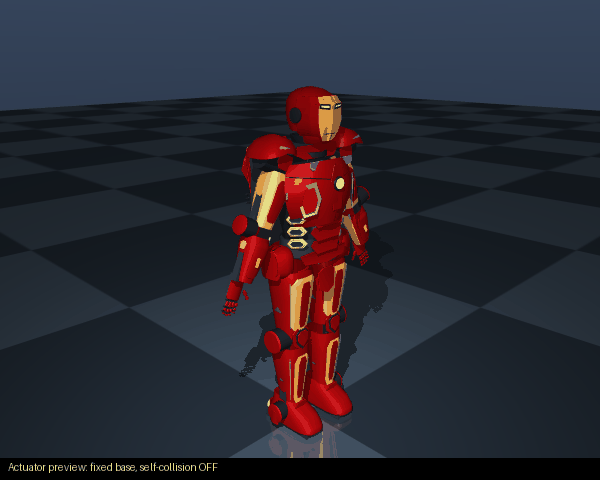
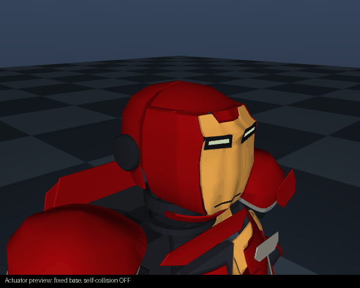
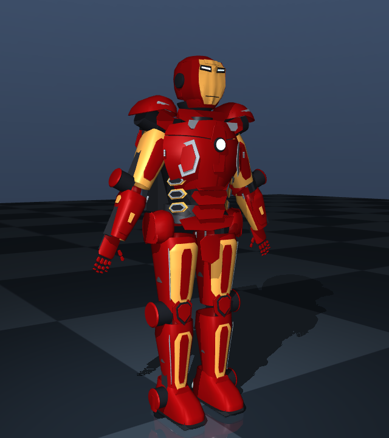
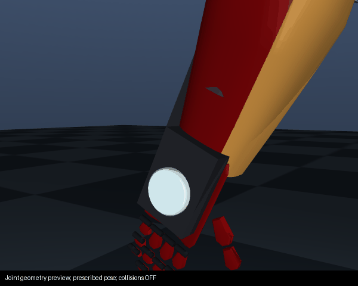
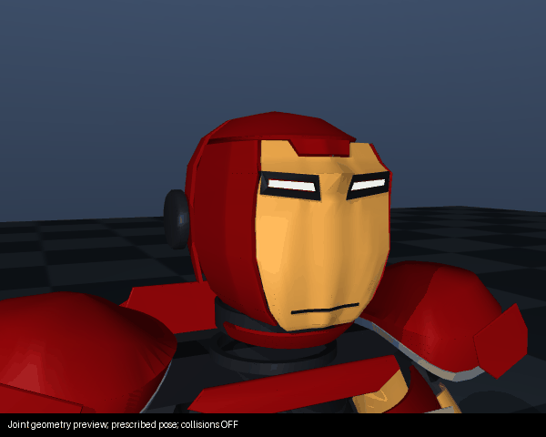
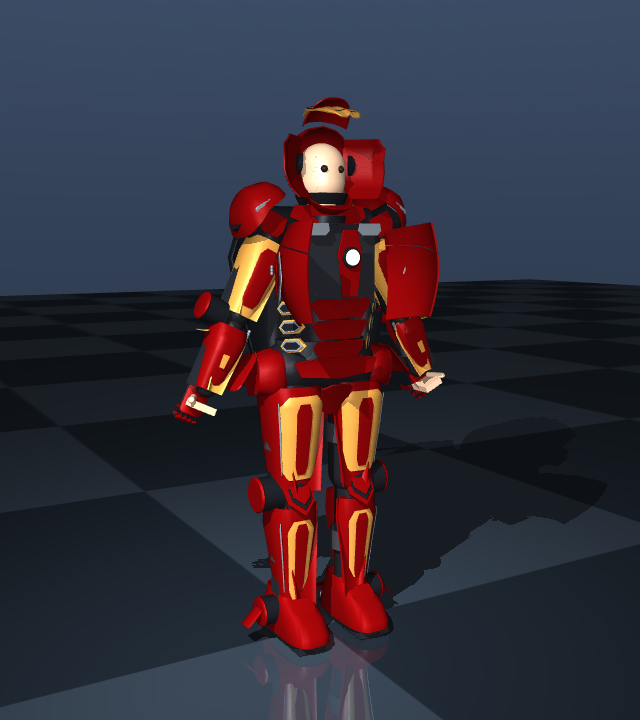

# Text to Robot

Describe a robot, inspect its generated 3D model, and download URDF/Xacro, ROS 2,
CAD and training packages. The service is free and self-hostable. It generates
robot concepts; it does not yet produce manufacturing-qualified machines from text.

The language model produces a typed `RobotSpecification`. Deterministic TypeScript
turns that specification into geometry and robot files. Python handles MuJoCo,
learning, collision decomposition and CadQuery solid CAD.

## Run the service

Requires Node.js 22.6 or newer; Python 3.10+ is needed for simulation/CAD.

```bash
git clone https://github.com/megazron/text-to-robot
cd text-to-robot
npm install
npm run api
# Open http://localhost:8787
```

Offline demo generation needs no API key. Optional model providers support more
open-ended prompts. The viewer supports joint controls, JSON import, modification,
version history, share links and downloads. To host the service, use
`docker compose up`; configure persistent storage for generated robots.
Simulation and learning run on the user's machine. Hosted GPU training is not
provided by the web service.

```bash
node cli/src/index.ts "Create a 6 DOF robotic arm with a parallel gripper"
node cli/src/index.ts validate examples/14_iron_man_mark_43/robot.urdf
```

Templates include arms, grippers, wheeled robots, legged robots and character
concepts. See [examples](examples/) and [architecture](docs/ARCHITECTURE.md).

## Current examples and animations

[Browse all 17 examples, their GIFs, MoveIt files and simulation results](examples/README.md).
Every example now has a dedicated README and downloadable ROS package.
All 17 ROS packages build on Jazzy; all 17 models load in both physics engines.
The 16 non-wearable examples have no initial inter-body penetration above 1 mm
in the MuJoCo audit. Motion tracking and balance failures remain documented.
The [runtime record](examples/runtime_validation.json) separates these checks.
All 17 [training exports](examples/training_validation.json) reset and take a finite
PyBullet step. A gripper aperture task passed Gymnasium checks in both engines and
64 PPO steps plus checkpoint reload; this is a pipeline check, not a trained skill.

Corrections include outward-facing humanoid grippers, downward spider shins,
SCARA base clearance, Baymax capsule lengths and arm spacing, continuous wheel
limits, and distinct MoveIt groups for arms and legs. Training now uses named tool
links, full-range reaching targets and an aperture task for standalone grippers.

## Iron Man: MoveIt and animated previews




These are fresh actuator previews of the exported geometry, using a fixed base
and self-collision disabled. They show articulation, not validated human entry.
The [Iron Man example README](examples/14_iron_man_mark_43/README.md) also shows the
collision-enabled physics GIF and exact failures.

**MoveIt:** [browse the SRDF, planning and controller configuration](examples/14_iron_man_mark_43/moveit/),
[download the ROS package](examples/14_iron_man_mark_43/robot.ros2.zip), and follow the
[launch instructions](examples/14_iron_man_mark_43/README.md#moveit--ros-2).
The suit still has a colliding start state; mock control wiring does not make it
physically buildable.

[Internet research and downloaded design inspection](references/mark43/RESEARCH.md)
now supplement the saved production photographs.

## Mark 43: current model and actual limits



The current model contains **268 links, 232 mesh instances using 216 unique STL
files and 86 actuated joints**. Each finger has three articulated segments, each
thumb has two, and the helmet has neck yaw and pitch. Chest inlays follow their
opening doors. Thigh, shin and arm trim now follows the underlying shell surface.
Fixed trim moves with its supporting plate; it does not need an independent motor.




These close-ups prescribe joint positions on the actual exported meshes with
collisions disabled. They demonstrate articulation, not safe motion or qualified
mechanisms. [Joint-motion evidence](examples/14_iron_man_mark_43/articulation_report.json).

Comparison now includes [Legacy Effects' Avengers: Age of Ultron production
references](https://www.legacyefx.com/avengersaou), alongside the licensed collectible
reference used previously. The [visual review](docs/MARK43_VISUAL_REVIEW.md) compares
specific shapes and shows front/rear views. **This is not movie-accurate yet.**
Chest continuity, helmet topology, rib placement, hand anatomy and exposed drive
modules remain conspicuous differences. No visual accuracy percentage is claimed. Reference photographs are now cached
locally and checked against saved iterations; see the [reference workflow](references/mark43/README.md).

| Check | Current evidence |
|---|---|
| Closed mesh topology and mass integrals | 232/232 mesh instances pass |
| Empty-suit smoke battery, self-collision off | 3/5; tracking and disturbance recovery fail |
| Suit with passive mannequin, human/self-contact disabled | See loaded physics report; actuator tracking still fails |
| Compound-convex initial collision | See regenerated clearance report; interference remains |
| Collision-enabled suit smoke battery | 1/6; see the example simulation report |
| Joint-range clearance | See regenerated motion-clearance report; interference remains |
| ROS 2 Jazzy / MoveIt | Controllers and scene start; suit planning fails collision validation |
| Six-axis arm MoveIt fixture | Planning and mock trajectory execution pass |
| Wearer fit | Example measurements fail opening/clearance checks |
| Breathing, structural strength, real hardware | Unverified |

Reports and downloadable files:

- [ROS 2 package](examples/14_iron_man_mark_43/robot.ros2.zip), [training package](examples/14_iron_man_mark_43/robot.training.zip), [CAD package](examples/14_iron_man_mark_43/robot.cad.zip).
- [Compound-convex MuJoCo/URDF model](examples/14_iron_man_mark_43/robot.convex.zip).
- [Physics](examples/14_iron_man_mark_43/mujoco_report.json), [loaded physics](examples/14_iron_man_mark_43/mujoco_report_wearer.json), [collision](examples/14_iron_man_mark_43/clearance_report.json), [motion clearance](examples/14_iron_man_mark_43/motion_clearance_report.json).
- [Wearability](examples/14_iron_man_mark_43/wearability_report.json), [suit MoveIt](examples/14_iron_man_mark_43/moveit_report.json), [arm MoveIt fixture](examples/14_iron_man_mark_43/moveit_fixture_report.json), [preliminary BOM](examples/14_iron_man_mark_43/BOM.md).

### Entry and breathing



Opening the panels does not establish that a person can enter. The current closed
pelvis and neck openings fail straight-insertion checks against the illustrative
wearer dimensions. Static human-contact checks also find interference in both open
and closed poses. These are proxy checks, not a continuous donning path or tissue
model. Measurements, separable frame interfaces, joint alignment and a manual
release system still need design and validation.

Decorative grilles and eye apertures do not establish breathable space. There is
no measured airflow, CO₂, temperature, fan-duct design or emergency breathing
assessment. The wearer report explicitly leaves these unresolved.

## ROS 2 and MoveIt

The ROS download includes an `ament_cmake` package, URDF/Xacro, meshes, RViz,
`ros2_control`, SRDF, joint limits, KDL and OMPL configuration. Wearables have
separate arm, leg, hand, torso and armour groups. Underactuated chains use
position-only IK; arbitrary six-dimensional targets may be unreachable.

```bash
# Unzip the ROS package into a ROS 2 Jazzy workspace's src directory.
source /opt/ros/jazzy/setup.bash
rosdep install --from-paths src --ignore-src -r -y
colcon build
source install/setup.bash
ros2 launch iron_man_mark_43 move_group.launch.py
# Add rviz:=false for headless execution.
```

MoveIt uses actual mesh triangles for collision geometry, retaining hollow parts.
Only adjacent links are automatically excluded. The launch runs
`mock_components/GenericSystem`: it validates ROS control/planning wiring, not
real motors or MuJoCo dynamics. The suit's colliding start state is reported as a
failure; collision checking is not disabled to force a successful plan.
The six-axis arm fixture was built, planned and executed through mock control on
ROS 2 Jazzy. Gazebo export is also available; it has not received the same runtime
validation in this revision.

## Physics and training

```bash
python -m venv .venv
source .venv/bin/activate
pip install -e './python[geometry,train]'
ttr-mujoco test examples/14_iron_man_mark_43/robot.sim.urdf --self-collision
# For training, unzip robot.convex.zip and use its collision-prepared model.
ttr-mujoco train path/to/robot.urdf --task stand --self-collision --steps 400000
# An arm reaching task must name the actual tool body:
ttr-mujoco train path/to/arm.urdf --task reach --tip-body gripper_base --self-collision
```

Training downloads bundle the Python MuJoCo runtime and requirements, alongside
PyBullet/Gymnasium training and evaluation scripts. PyBullet environments have
independent clients and use per-joint force/velocity limits. MuJoCo reaching
requires an explicit tool body. Invalid actions are rejected and numerical
failures terminate unsuccessfully.

A six-axis arm passed Gymnasium checks in both engines and a 64-step PPO
checkpoint smoke run. This proves the training pipeline starts and saves; it does
not establish a capable policy or a trained wearable. Self-collision is opt-in in
the converter, so enable it explicitly when assessing physical behavior.

Mesh mass properties come from closed-solid volume integrals. MuJoCo preserves
COM, rotated/full inertia tensors, collision offsets and per-joint effort limits.
Tracking checks use trajectory RMS error. Servo gains, friction and motor dynamics
remain approximate; torque-speed, heat, power draw, compliance and backlash are
not calibrated. A passing smoke test is not evidence of sim-to-real accuracy.

## CAD and real components

CAD downloads contain STL, parametric OpenSCAD and the Python CadQuery enclosure
backend. Dimensioned board manifests can produce STEP base/lid solids, standoffs
and openings. The attachment workflow embeds their meshes and mass properties in
robot JSON for import into the viewer. See [physical fidelity](docs/PHYSICAL_FIDELITY.md)
and [Python instructions](python/README.md).

The BOM is preliminary. CubeMars AK80-64 selection now uses the manufacturer's
48 Nm rated torque rather than 120 Nm peak torque. A hypothetical custom actuator
is excluded from automatic selection. Budget fit, torque sizing and verified
hardware are separate outcomes. Real mounting drawings, bearings, transmissions,
connectors, cable clearances, power/thermal design and load tests remain necessary;
printing the armour does not supply these missing mechanisms.

## Reproduce and develop

```bash
npm test
npm run typecheck
pip install -e './python[cad,geometry]'
python -m unittest discover -s python/tests -v
node scripts/regen_mark43_example.ts
python scripts/audit_mark43.py --convex
python scripts/check_mesh_assets.py --json examples/14_iron_man_mark_43/mesh_quality_report.json
python scripts/render_mark43_review.py
node scripts/export_mark43_packages.ts /tmp/ttr-mark43-packages
```

Regeneration invalidates reports and download bundles tied to old geometry.
Software regressions and mesh checks gate CI; failing concept physics remains
visible in diagnostic reports. Next engineering milestones are continuous
reference-based armour surfaces, collision-free mechanisms, measured wearer fit,
qualified component interfaces and hardware-calibrated dynamics. They are not
implemented merely because they appear in a roadmap.

Code is MIT licensed; see [LICENSE](LICENSE). Character references and associated
intellectual property belong to their respective owners.
