# 🤖 Text&nbsp;to&nbsp;Robot

### «Describe a robot. Get a ROS&nbsp;2 robot.»

Text-to-speech turns words into audio. **Text-to-Robot turns words into a robot** — a validated URDF/Xacro, an interactive 3D model, a buildable ROS 2 package, and a **MuJoCo simulation you can test and train**. Describe anything — a 6-DOF arm, a Mars rover, WALL-E, an Iron Man suit — and get a parameterized robot concept for simulation. Generated geometry is not yet a manufacturing-qualified design.

```
        TEXT                          ROBOT                         ROS 2
"Create a 6 DOF robotic     →   interactive 3D model,    →   URDF / Xacro +
 arm with a parallel             joints you can move          ament package you
 gripper."                        with sliders                 can colcon build
```

> The hard rule that makes this reliable: **the language model never writes URDF.**
> It only produces a typed `RobotSpecification`. Deterministic, tested code turns
> that into XML. See [Architecture](docs/ARCHITECTURE.md).

<p align="center"></p>

<p align="center">
  
  
</p>

<p align="center"><i>Every screenshot is the real app in demo mode — no API key. Left: a six-legged scout generated from a prompt. Right: a Mars rover with its live Bill of Materials.</i></p>

## From a sentence to the Mark 43 in MuJoCo

> *"Build me a movie-accurate wearable Iron Man Mark 43 suit from Age of Ultron with all the small polygon armour plates that open and close, repulsors, a HUD and an IMU. Budget $60000"*

The current Mark 43 is a **procedural powered-exoskeleton concept**, not a film-accurate
or fabrication-ready suit. It includes a 17-joint frame, 150 closed mesh solids, including hollow frame/cuff parts and layered armour,
49 armour hinges and a passive mannequin. Geometry is procedural, with palette/proportion corrections against a commercial reference, without
prop scans, measured wearer geometry or validated component interfaces.

**Fidelity corrections:** exported mesh centres of mass and rotated collision offsets
are now preserved; MuJoCo actuators use each URDF joint's effort limit, not a shared
whole-robot force allowance. Root/full inertia tensors retain their orientation. A fallen
robot now fails disturbance recovery. Regenerated results are recorded below. Meshes now use closed-solid volume integrals for mass and inertia, hollow cuffs, and actual faceplate eye apertures.


See the [front/rear visual review and reference comparison](docs/MARK43_VISUAL_REVIEW.md).

The following animations were produced with the **older modelling assumptions** and
are illustrations, not validation evidence for the corrected model.

<p align="center">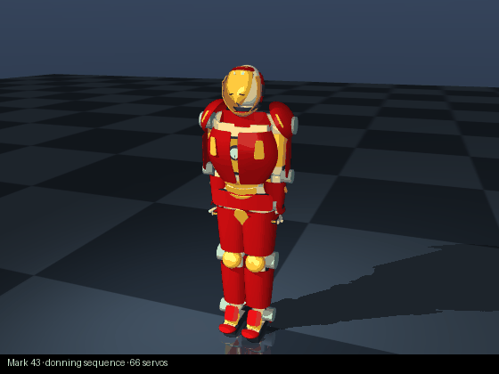</p>
<p align="center"><i>The donning sequence, simulated in MuJoCo: boots and shins first, then legs, torso, arms, faceplate last — every plate is a servo-driven hinge closing around the person inside.</i></p>

<p align="center">
  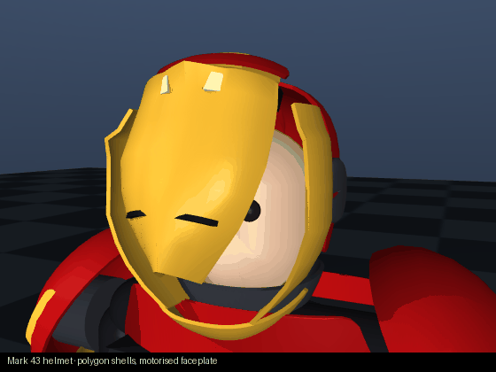
  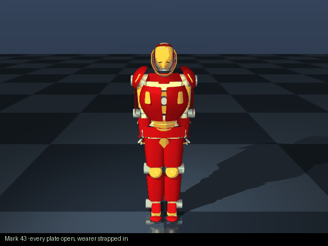
</p>
<p align="center">
  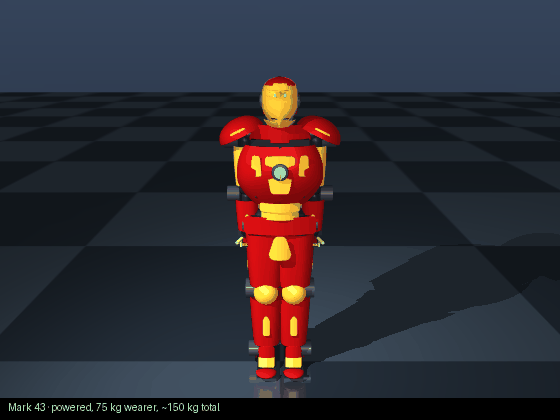
  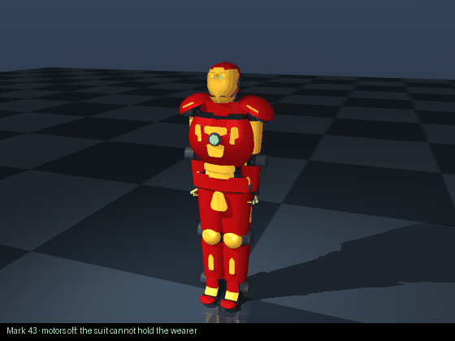
</p>
<p align="center">
  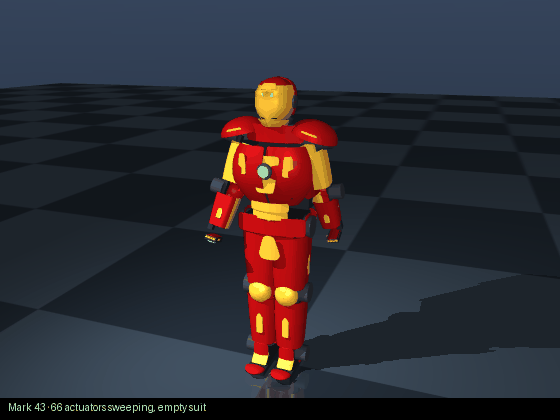
  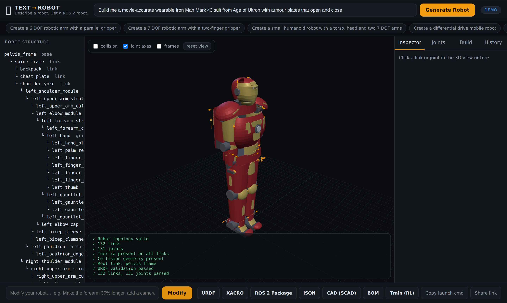
</p>

| Corrected Mark 43 checks | Result |
|---|---|
| Empty suit smoke battery | **3/5**; fails trajectory tracking and disturbance recovery |
| Suit + mannequin | **5/6**, including support comparison; fails actuator sweep (45/66 track) |
| Initial pose, self-collision enabled | See [clearance report](examples/14_iron_man_mark_43/clearance_report.json); both box and convex models still fail clearance |
| Closed STL solids + mass-integral audit | **150/150** |
| Compound convex collision, initial pose | **843 penetrating contacts**, maximum depth ≈ 13 mm; clearance fails |
| Sampled joint-range clearance | **595 poses checked; fails**; see [witness positions](examples/14_iron_man_mark_43/motion_clearance_report.json) |
| Film accuracy / wearer fit / fabrication | **Unverified** |

See the regenerated `mujoco_report*.json` and `clearance_report.json` in the example.
The collision report compares boxes with decomposed convex solids. Download the portable
[convex collision model](examples/14_iron_man_mark_43/robot.convex.zip) for MuJoCo.
This initial-pose audit does not validate motion paths or contact with a human. The mannequin uses
ideal weld constraints and disabled human contact, not a validated strap/tissue model.

**Can it be built?** Not from these files alone. The BOM is a preliminary selection,
not a mechanically integrated design. Missing work includes measured component CAD,
actuator mounting and transmissions, bearings, tolerances, cable paths, thermal/power
limits, structural verification, human joint alignment, emergency release and prototype
measurements. A successful simulation rollout does not establish any of these.

**Honest notes.** The panel map and palette were compared with [Hot Toys reference photographs](https://www.sideshow.com/collectibles/marvel-iron-man-mark-xliii-hot-toys-902314), not scanned prop data — the shapes are procedural (lofted
superellipse sections, plates wrapped on cylinders) rather than the hand-sculpted compound surfaces
of a screen-used suit, and the exoskeleton frame is visible between plates on purpose: this is a
wearable machine, not a costume. Everything is in `examples/14_iron_man_mark_43/`: prompt,
`robot.json`, `robot.urdf` (ROS `package://` mesh paths), `robot.sim.urdf` (relative paths for
MuJoCo/PyBullet), the 150 binary STLs in `meshes/`, both MJCFs (suit, and suit + wearer), BOM,
`mujoco_report.json` and `mujoco_report_wearer.json`.

### The polygon mesh engine

<p align="center">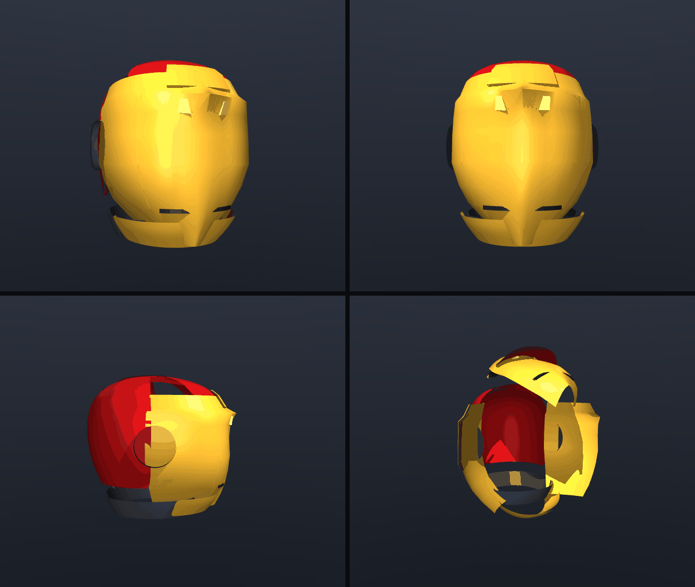</p>

`@ttr/mesh` is a small procedural modelling kernel written for this: lofts, revolves, superellipse
arcs, shelling to a wall thickness, Loop subdivision, curved plates (a rounded outline wrapped on a
cylinder with bevelled rims and grid-filled faces), tapered limb shells, domes, discs, and a 1:1
helmet built from a sampled face profile. Every part is a **recipe** — a generator name plus
parameters — stored in the robot JSON, so the API, the CLI, the exporters and the CAD layer all
rebuild the identical STL on demand and the browser viewer streams them from `/api/robots/:id/mesh/`.
Mass properties use exact tetrahedral volume integrals of consistently wound, closed solids.
Open/nonmanifold meshes are rejected. An independent trimesh audit checks all 150 Mark 43
STLs against their exported volume, centre of mass and full inertia tensor. Default collision
uses boxes; the optional Python `ttr-collision` tool exports compound convex geometry.
CAD tessellations can also be embedded as indexed meshes in the same JSON/export pipeline.

## Free & self-hostable

Text to Robot is **free and open-source**, and designed to run as a **free service**: clone it and `npm run api`, or deploy the same server anywhere. No API key is required — an offline deterministic engine powers everything, and optional OpenAI/Anthropic keys just improve open-ended prompts. The end goal: **describe a robot, download it, and immediately test and train it in MuJoCo** (see [Simulate & train in MuJoCo](#simulate--train-in-mujoco)).

---

## Why Text to Robot?

Writing URDF by hand is slow and error-prone: nested XML, inertia tensors, joint
limits, frame conventions. Asking an LLM to emit raw URDF is worse — it hallucinates
tags, invents inertias and breaks the kinematic tree. Text-to-Robot splits the
problem the right way:

- **The LLM does understanding** — turning "6 DOF arm with a gripper" into structure.
- **Deterministic code does generation** — inertia from geometry, validated topology,
  clean XML, every time.

The result is reproducible, testable, and works **with no API key at all** (deterministic
demo mode), so the repo runs the moment you clone it.

## Features

- 🗣️ **Natural-language generation** — arms, mobile bases, quadrupeds, humanoids, grippers.
- 🧱 **Typed RobotSpecification** — one strongly-typed IR for the whole pipeline.
- 🧮 **Automatic inertia** — box / cylinder / sphere / capsule tensors from geometry + mass.
- ✅ **Real validation** — single root, no cycles, unique names, valid limits, positive mass,
  physically-plausible inertia; plus a self-healing repair loop (max 3 attempts).
- 🧊 **Interactive 3D viewer** — Three.js, orbit/zoom/pan, click to inspect, **joint sliders**
  driven by forward kinematics — no ROS required in the browser.
- ✏️ **Natural-language modification** — "make the forearm 30% longer", "add a camera to the head",
  "replace the gripper with a suction gripper" — edits the existing spec, with a **git-style diff**.
- 🕑 **Version history** — every change is a version you can switch between.
- 📦 **ROS 2 export** — a complete `ament_cmake` package with `display.launch.py`, RViz config,
  joint limits, and optional `ros2_control`.
- 💸 **Bill of Materials to a budget** — picks *real* actuators (sized by the torque each joint
  must hold), sensors, compute, power and structure, and tells you what it costs and whether it
  fits your budget. Selections still need component drawings, continuous-duty ratings and mechanical integration.
- 🛠️ **CAD parts** — **STL** concept meshes (native, no OpenSCAD needed) plus parametric OpenSCAD source for every link and the assembly, with a **printability report**.
- 🤖 **MoveIt 2 + Gazebo** — an SRDF planning group, kinematics/controllers/OMPL config and a `move_group` launch; a Gazebo (gz-sim) world and spawn launch.
- 🔗 **Shareable robot links** — every generated robot gets a URL (`/r/<id>`) that reopens it, persisted on the server. Free-SaaS ready with the included Dockerfile.
- 🧪 **Physics-validated** — every example loads and simulates in PyBullet; the generated training suite has been run end to end (RL, imitation, evaluation).
- 🧪 **MuJoCo, first-class** — `ttr-mujoco` converts the URDF to an actuated MuJoCo scene (mass-scaled servos, floor, free base), runs a simulation test battery, renders headless GIFs, and trains PPO. The battery reports failures; passing is a smoke check, not hardware validation.
- 🏋️ **Train it** — a downloadable training suite (MuJoCo + PyBullet, Gymnasium, PPO/SAC, imitation learning, evaluation) that loads the generated robot directly.
- 🚀 **Any robot you can describe** — templates for arms, bases, legged robots and hands, plus sci-fi builds with real mechanisms: a **wearable Iron Man Mark 43 in polygon-mesh armour (150 mesh parts, 49 articulated)** (simulated donning with a person inside), **WALL-E, EVA, Baymax**, spider-bots, Mars rovers, battle mechs.
- 🖥️ **CLI + HTTP API** — scriptable and embeddable.
- 🔌 **Pluggable LLMs** — OpenAI, Anthropic, or deterministic demo mode.

## Architecture

```
prompt → LLM (or demo parser) → RobotSpecification → validate → repair → inertia →
         URDF/Xacro → validate → 3D viewer + ROS 2 package
```

Two languages, on purpose: **TypeScript** for the deterministic generator, validator and browser viewer (zero-build, runs anywhere Node runs, and in the browser), and **Python** for everything simulation and learning — MuJoCo, Gymnasium, PPO — because that is where the robotics/ML ecosystem lives. The URDF is the contract between them.

Full diagram and package map in [docs/ARCHITECTURE.md](docs/ARCHITECTURE.md).

## Supported robots

Templates (used as sensible starting points the AI can customize):

| | | |
|---|---|---|
| 2 / 3 / 6 / 7 DOF arms | SCARA | Parallel & two-finger grippers |
| Differential drive | Four-wheel | Mecanum |
| Quadruped | Hexapod (18 DOF) | Humanoid (torso, head, two arms, two legs) |
| Rover + arm (mobile manipulator) | Parallel & suction grippers | ...and anything a prompt implies |

Seventeen worked examples (including Iron Man, WALL-E, EVA and Baymax) live in [`examples/`](examples/) — each passes schema **and** URDF validation, and each has a MuJoCo render in the [gallery](#examples).

## Installation

Requires **Node.js ≥ 22.6** (uses native TypeScript execution — no build step). No other runtime dependencies.

```bash
git clone https://github.com/megazron/text-to-robot
cd text-to-robot
npm install          # links the workspace packages (no third-party deps to download)
npm test             # 70 tests
```

## Quick start

**Web app (the full experience):**

```bash
npm run api
# open http://localhost:8787
```

Type a prompt, watch the robot appear, drag the joint sliders, then click **ROS 2 Package**. Click
**Share link** to copy a URL that reopens that exact robot.

**Docker (one command, for hosting it as a free service):**

```bash
docker compose up            # or: docker build -t text-to-robot . && docker run -p 8787:8787 -v ttr-data:/data text-to-robot
```

Generated robots are persisted under `/data` so share links survive restarts.

**CLI:**

```bash
node cli/src/index.ts "Create a 6 DOF robotic arm with a parallel gripper"
# → ./out/arm_6dof/  (ROS 2 package, URDF/Xacro, BOM.md, cad/, training/, JSON)
```

## CLI

```bash
text-to-robot "<prompt>"                         # generate (bare prompt)
text-to-robot generate "<prompt>" -o mydir/      # generate into mydir/ (default: ./out/<name>/)
text-to-robot modify robot.json "make it longer" # modify an existing spec
text-to-robot validate robot.urdf                # structural URDF validation
text-to-robot inspect robot.urdf                 # print links + joints
```

(Invoke with `node cli/src/index.ts ...`, or `npm link` the `cli` workspace to get the
`text-to-robot` binary on your PATH.)

## ROS 2

The exported package is a normal `ament_cmake` package:

```
my_robot/
├── package.xml
├── CMakeLists.txt
├── urdf/my_robot.urdf.xacro     # real Xacro: <xacro:macro> inertials
├── urdf/my_robot.urdf           # flattened URDF
├── launch/display.launch.py     # robot_state_publisher + joint_state_publisher_gui + rviz2
├── config/joint_limits.yaml
├── config/controllers.yaml      # optional ros2_control
├── moveit/my_robot.srdf         # MoveIt 2: planning group, kinematics, controllers, OMPL
├── launch/move_group.launch.py  # MoveIt 2 move_group + RViz MotionPlanning
├── worlds/my_robot.sdf          # Gazebo world
├── launch/gazebo.launch.py      # spawn into Gazebo via ros_gz_sim
├── rviz/my_robot.rviz
└── README.md
```

```bash
ros2 launch my_robot move_group.launch.py   # plan & execute with MoveIt 2
ros2 launch my_robot gazebo.launch.py       # simulate in Gazebo
```

```bash
cp -r my_robot ~/ros2_ws/src/
cd ~/ros2_ws && colcon build --packages-select my_robot
source install/setup.bash
ros2 launch my_robot display.launch.py
```

## Real-world buildability (Bill of Materials)

A robot you can see is not a robot you can build. Text to Robot estimates the **real components**
needed and their cost, and fits them to a **budget** you give:

- **Actuators sized by physics** — for each joint it estimates the holding torque from the mass and
  reach of everything downstream, then picks a real actuator (hobby servo → Dynamixel → BLDC) with a
  1.5× margin.
- **Everything else** — sensors (cameras, LiDAR, IMU), compute (ESP32 → Raspberry Pi → Jetson),
  power (LiPo + regulator + distribution), structure (3D-printed or aluminium, from the total mass),
  and wiring.
- **Budget aware** — give a budget and it chooses the richest component tier that fits, or tells you
  honestly that it does not fit and by how much.

```bash
text-to-robot bom my_robot.json 800     # estimate a build at an $800 budget
```

Prices are planning estimates, not quotes. The output is a full table (`BOM.md`) plus a per-joint
actuator sizing table.

## CAD parts

Two deliverables per robot, both in millimetres:

- **STL, ready to print** — `cad/stl/<robot>_assembly.stl` and one mesh per link in `cad/stl/parts/`,
  triangulated natively (no OpenSCAD required). Drop them straight into a slicer.
- **OpenSCAD source** — `cad/<robot>.scad` and `cad/parts/*.scad` for parametric edits; re-mesh with
  `openscad -o part.stl part.scad`.

`cad/PRINTABILITY.md` checks every part against a desktop FDM build volume and flags thin features and
parts that need splitting or supports.

## Simulate & train in MuJoCo

The vision: **describe a robot, download it, and start testing and training it.** The Python layer in
[`python/`](python/) turns any generated URDF into a real MuJoCo simulation:

```bash
pip install "git+https://github.com/megazron/text-to-robot#subdirectory=python[train]"
pip install torch --index-url https://download.pytorch.org/whl/cpu      # CPU torch on GPU-less machines

ttr-mujoco test   examples/14_iron_man_mark_43/robot.sim.urdf --wearer    # battery + powered-vs-unpowered wearer test
ttr-mujoco render examples/14_iron_man_mark_43/robot.sim.urdf --wearer -o don.gif --motion don --azimuth 200 --orbit 50   # donning sequence
ttr-mujoco render examples/14_iron_man_mark_43/robot.sim.urdf --wearer -o helmet.gif --motion don --focus helmet --zoom 0.6  # helmet close-up
ttr-mujoco train  examples/08_humanoid/robot.urdf --task stand --steps 400000
```

What the converter guarantees: position actuators on every joint with gains scaled to the robot's
mass; per-joint URDF effort limits enforced; the URDF's designed masses/inertias preserved (including the root link on a floating base);
floor + lighting; a free base for legged/wheeled/flying robots (auto-detected); self-collision off
by default because primitive-built robots overlap at their joints. The Gymnasium env uses **delta
actions around the standing pose** (action 0 = hold still) and random pushes on the `stand` task, so
a policy has to actually balance.

Each generated robot also ships a `training/` suite (MuJoCo quick-start plus a **PyBullet + Gymnasium**
fallback that loads the URDF directly). No ROS required.

```bash
cd training && pip install -r requirements.txt
python train_rl.py --task reach --algo ppo   # reinforcement learning (PPO or SAC)
python collect_demos.py --episodes 50        # scripted expert -> demos.npz
python train_bc.py                           # imitation learning (behaviour cloning)
python evaluate.py --task reach --rl <model> # success rate
```

Tasks are chosen from the robot's class (manipulator → reach/track/hold, mobile → drive/goto,
locomotion → walk/balance/turn) and are easy to extend in `tasks.py`. Classical motion planning is
available through the exported MoveIt 2 config. **This suite is verified**: the generated environments
run for every robot class, and the full pipeline (demo collection → PPO/SAC → behaviour cloning →
evaluation) has been executed end to end on a generated arm.

## AI architecture

`packages/llm-providers` defines a small `LlmProvider` interface with `generateSpec` and
`modifySpec`. Two cloud adapters (OpenAI, Anthropic) ask the model for a **JSON
RobotSpecification** — never XML — using a strict system prompt. If no `OPENAI_API_KEY` /
`ANTHROPIC_API_KEY` is set, the app uses a **deterministic demo parser** (keyword + regex)
so it always works offline. Cloud output is untrusted: it is JSON-parsed, coerced, then run
through the same validation + repair loop as everything else.

```bash
export ANTHROPIC_API_KEY=sk-...   # or OPENAI_API_KEY=...
npm run api                       # badge switches from "demo" to "cloud"
```

Keys are read only on the server and never sent to the browser.

## URDF generation

Deterministic, in `packages/urdf-generator`: `generateRobot`, `generateLink`, `generateJoint`,
`generateVisual`, `generateCollision`, `generateInertial`, `generateMaterial`, `generateLimits`.
The Xacro output uses real `<xacro:macro>` inertials computed with `${...}` expressions.
URDF has no capsule primitive, so capsules are emitted as cylinders (documented in the output).

## Validation

Every robot is checked for: exactly one root, no cycles, all parent/child links exist, one
parent per child, unique link/joint names, valid joint types and axes, valid limits, positive
masses and dimensions, and physically-plausible inertia (positive principal moments + triangle
inequality). Invalid specs enter a **repair loop** (drop dangling joints, de-duplicate names,
enforce a single root, fix limits/axes, clamp masses) for up to 3 attempts. Failures are shown,
never hidden. Structural validation runs on every robot. In addition, `scripts/physics_check.py` loads
every example URDF in **PyBullet** and steps it, so the shipped examples are known to simulate —
run it yourself with `pip install pybullet numpy && python scripts/physics_check.py`. Physics checks
are a sanity gate, not a guarantee of real-world dynamic performance.

## Examples

Every example below is the generator's own output, converted to MuJoCo and rendered by
`ttr-mujoco render` — no hand-editing. Click one to open its folder (prompt, JSON, URDF, MJCF, BOM,
`mujoco_report.json`).

<table>
<tr><td align="center"><a href="examples/01_arm_2dof/">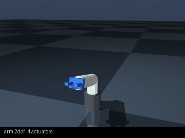</a><br><sub><b>1. 2 DOF arm</b></sub></td><td align="center"><a href="examples/02_arm_6dof/">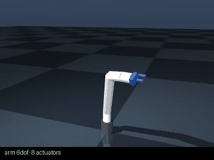</a><br><sub><b>2. 6 DOF arm + gripper</b></sub></td><td align="center"><a href="examples/03_arm_7dof/">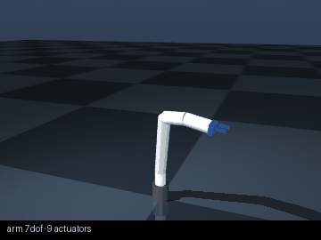</a><br><sub><b>3. 7 DOF arm + gripper</b></sub></td><td align="center"><a href="examples/04_scara/">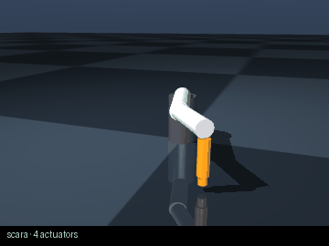</a><br><sub><b>4. SCARA</b></sub></td></tr>
<tr><td align="center"><a href="examples/05_diff_drive/">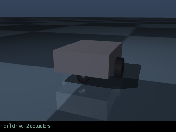</a><br><sub><b>5. Differential drive</b></sub></td><td align="center"><a href="examples/06_four_wheel/">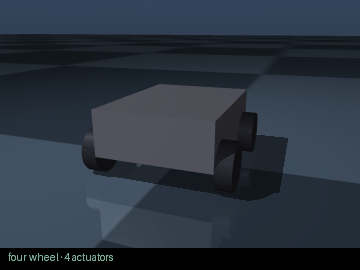</a><br><sub><b>6. Four-wheel</b></sub></td><td align="center"><a href="examples/07_mecanum/"></a><br><sub><b>7. Mecanum</b></sub></td><td align="center"><a href="examples/08_humanoid/">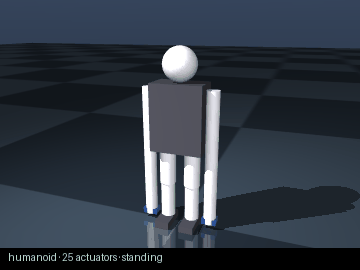</a><br><sub><b>8. Humanoid</b></sub></td></tr>
<tr><td align="center"><a href="examples/09_gripper/">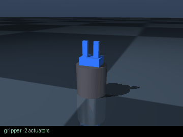</a><br><sub><b>9. Parallel gripper</b></sub></td><td align="center"><a href="examples/10_quadruped/">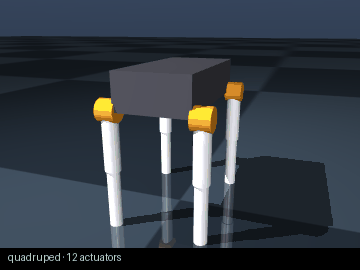</a><br><sub><b>10. Quadruped</b></sub></td><td align="center"><a href="examples/11_spider_scout/">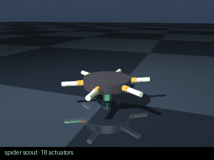</a><br><sub><b>11. Spider scout</b></sub></td><td align="center"><a href="examples/12_mars_rover/">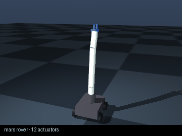</a><br><sub><b>12. Mars rover</b></sub></td></tr>
<tr><td align="center"><a href="examples/13_battle_mech/">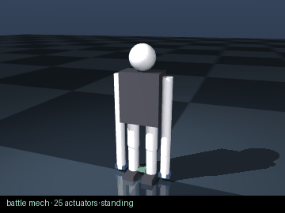</a><br><sub><b>13. Battle mech</b></sub></td><td align="center"><a href="examples/14_iron_man_mark_43/">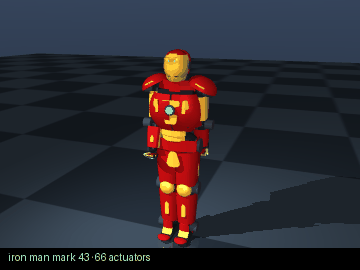</a><br><sub><b>14. Iron Man Mark 43</b></sub></td><td align="center"><a href="examples/15_wall_e/">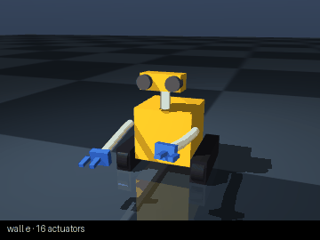</a><br><sub><b>15. WALL-E</b></sub></td><td align="center"><a href="examples/16_eva/">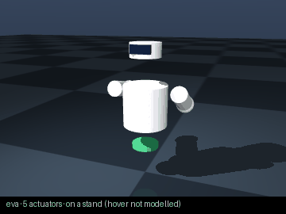</a><br><sub><b>16. EVA</b></sub></td></tr>
<tr><td align="center"><a href="examples/17_baymax/">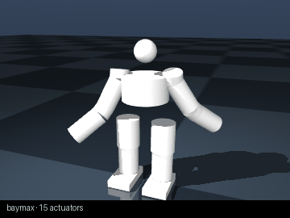</a><br><sub><b>17. Baymax</b></sub></td></tr>
</table>

```bash
node cli/src/index.ts validate examples/02_arm_6dof/robot.urdf
```

| # | Example | Prompt |
|---|---|---|
| 1 | 2 DOF arm | `Create a 2 DOF robotic arm` |
| 2 | 6 DOF arm | `Create a 6 DOF robotic arm with a parallel gripper` |
| 3 | 7 DOF arm | `Create a 7 DOF robotic arm with a two-finger gripper` |
| 4 | SCARA | `Create a SCARA robot` |
| 5 | Differential drive | `Create a differential drive mobile robot` |
| 6 | Four-wheel | `Create a four-wheel robot` |
| 7 | Mecanum | `Create a mecanum-wheel robot` |
| 8 | Humanoid | `... torso, head and two 7 DOF arms and two-finger grippers` |
| 9 | Gripper | `Create a two-finger parallel gripper` |
| 10 | Quadruped | `Create a quadruped robot` |
| 11 | Spider scout | `Build a six-legged reconnaissance spider-bot with a LiDAR turret, budget $1500` |
| 12 | Mars rover | `Design a Mars rover with four wheels and a 6 DOF sampling arm, RGB-D camera, budget $4000` |
| 13 | Battle mech | `Create a humanoid battle mech with two 7 DOF arms, a head camera and an IMU` |
| 14 | **Iron Man Mark 43 (wearable, polygon armour)** | `Build me a movie-accurate wearable Iron Man Mark 43 suit from Age of Ultron with all the small polygon armour plates that open and close, repulsors, a HUD and an IMU. Budget $60000` |
| 15 | **WALL-E** | `Build WALL-E: a tracked trash-compactor robot with a telescoping neck, binocular eyes and two gripper arms` |
| 16 | **EVA** | `Build EVA, a sleek hovering egg-shaped droid with a visor and two floating arms` |
| 17 | **Baymax** | `Build Baymax, an inflatable healthcare companion robot` |

Examples 14–17 illustrate articulated concepts. Older reports and renders for characters
other than Mark 43 predate the fidelity fixes; regenerate them before assessing performance.
The offline parser routes prompts to templates; it does not solve arbitrary engineering
requirements or infer vendor-accurate mechanical interfaces.

## Development

```
text-to-robot/
├── apps/            web (Three.js viewer) + api (zero-dep HTTP server)
├── python/          ttr-mujoco: URDF -> MuJoCo convert / test / render / train
├── packages/        robot-schema, kinematics, robot-templates, urdf-generator,
│                    urdf-validator, llm-providers, robot-generator, ros2-export
├── cli/             text-to-robot command
├── examples/        10 validated robots
├── tests/           70 node:test cases
└── docs/            architecture
```

Pure TypeScript, run directly by Node 22 (type stripping). No bundler, no transpile step.

```bash
npm test              # run the suite
npm run typecheck     # tsc --noEmit (optional; needs a local typescript)
npm run api           # serve web + API on :8787
```

## Solid CAD and physical fidelity

Python adds value as a **solid CAD and verification backend**, while TypeScript remains
responsible for the web app and typed generation. CAD downloads now include a portable
CadQuery enclosure generator in `cad/hardware/`. It generates a separate hollow base and
lid, PCB standoffs, through-bolt holes, a cable opening, STEP/STL files and CAD-derived
mass properties. It validates solid topology and interference with a supplied board envelope.
CadQuery supports [solid STEP and mesh STL exports](https://cadquery.readthedocs.io/en/latest/importexport.html).

```bash
pip install -e './python[cad,geometry]'
ttr-enclosure python/ttr_cad/example_enclosure.json --out out/electronics_bay
python -m unittest discover -s python/tests -v
# Reveal intersections when converting a robot for a smoke test:
ttr-mujoco test examples/14_iron_man_mark_43/robot.sim.urdf --self-collision
```

The enclosure example uses **synthetic dimensions**, not a vendor-verified PCB. Replace
them with your measured board envelope, mounting-hole coordinates, clearance and material
density. `ttr-attach-enclosure` adds the CAD base/lid and measured electronics mass to
a chosen robot link at an explicit mounting transform. Use **Import JSON** in the browser
to view the updated assembly and download its URDF/CAD. Fasteners, mount strength and
cable/connector/thermal clearance still require engineering.

```bash
ttr-attach-enclosure examples/14_iron_man_mark_43/robot.json \
  python/ttr_cad/example_enclosure.json --parent backpack \
  --xyz -0.3 0 0.2 --rpy 0 -1.5707963268 0 \
  --electronics-mass-kg 0.045 --out out/attached
# Above dimensions/mass/pose are illustrative, not a verified installation.
ttr-collision examples/14_iron_man_mark_43/robot.sim.urdf --out out/convex
ttr-mujoco test out/convex/robot.urdf --self-collision
```

See [the fidelity audit and remaining design work](docs/PHYSICAL_FIDELITY.md).

## Roadmap

- [x] Natural-language robot generation
- [x] Typed RobotSpecification + schema/topology/physics validation
- [x] Deterministic URDF + Xacro generation
- [x] Automatic inertia
- [x] Interactive 3D viewer + joint sliders (forward kinematics)
- [x] Natural-language modification + version history + diff
- [x] ROS 2 package export (+ optional ros2_control)
- [x] CLI + HTTP API + demo mode
- [x] Preliminary Bill of Materials sized to a cost budget (hardware integration unverified)
- [x] Parametric CAD (OpenSCAD) parts + assembly
- [x] Downloadable training suite: RL (PPO/SAC), imitation learning, evaluation — verified end to end
- [x] MoveIt 2 configuration + Gazebo world export
- [x] Native STL mesh export + printability checks
- [x] Physics validation of all examples (PyBullet)
- [x] Shareable robot links + persistence + Dockerfile
- [x] MuJoCo layer: convert, simulation test battery, headless render, PPO training
- [x] Sci-fi builds with real mechanisms: a wearable Iron Man Mark 43 in procedural polygon armour (150 mesh parts, 49 hinged, motorised helmet) with a simulated donning sequence, WALL-E, EVA, Baymax — concept examples, not hardware-qualified designs
- [x] Procedural polygon mesh parts (`@ttr/mesh`): recipes in the robot JSON, STL on demand, streamed to the viewer, shipped in ROS 2 / training / CAD exports

Future (toward a free hosted service where you describe, download and train a robot):

- [ ] Public hosted instance (free SaaS) with accounts and a robot gallery
- [ ] Isaac Lab backend and a richer task library (walk, manipulate, fly)
- [ ] Real-part catalog integration with live pricing and stock
- [ ] STEP export and assembly-level printability (fasteners, tolerances)
- [ ] Isaac Sim world export
- [ ] MoveIt 2 config generation
- [ ] Automatic mesh / STL / OpenSCAD generation
- [ ] Physics-based (not just structural) validation
- [ ] Automatic sensor placement + perception stack
- [ ] Generate robot + controller + task plan

## Contributing

Issues and pull requests welcome. Please keep the core rule intact: LLMs produce
`RobotSpecification`, deterministic code produces URDF. Add a test for any new behaviour.

## License

MIT — see [LICENSE](LICENSE).
