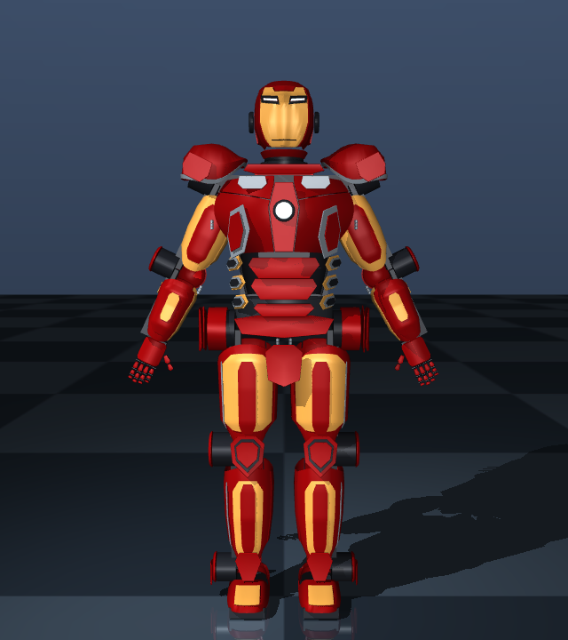
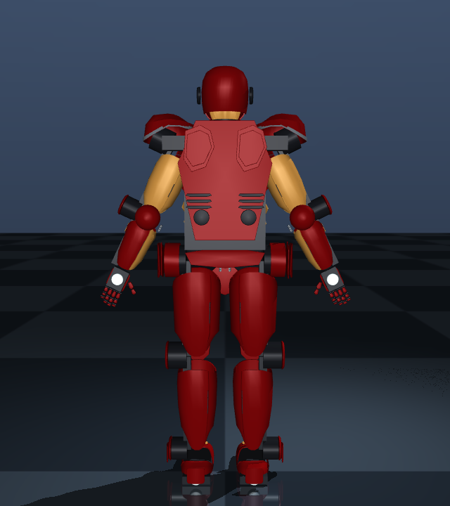
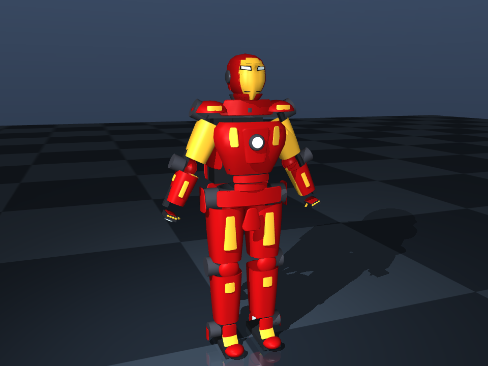
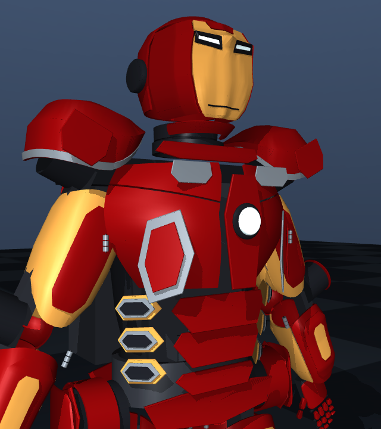
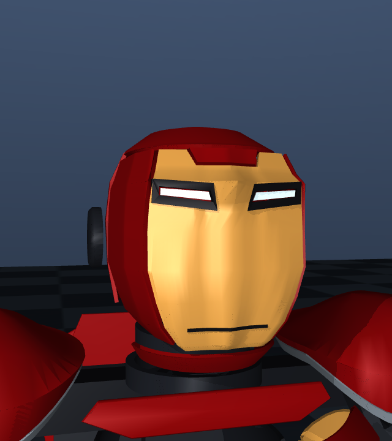

# Mark 43 visual review

The previous model passed geometry checks while still looking unlike the reference.
Those checks establish valid solids, not visual fidelity. This revision changes the
actual exported geometry; these images are MuJoCo renders of the URDF/STL assets.
They are not concept art or image-generation outputs.

Primary reference inspected: [Legacy Effects — Avengers: Age of Ultron](https://www.legacyefx.com/avengersaou),
including its [production armour photograph](https://images.squarespace-cdn.com/content/v1/5bfdc74875f9ee194f3e0add/1597169230901-1YAKVO4QHQGB94IZ7KF2/2014-02-27_17077.jpg).
The photograph shows continuous curved pectoral surfaces, silver shoulder-edge
mechanisms, silver collar panels and rib details wrapped around the flanks.
The current export replaces isolated pectoral badges with adjoining compound
surfaces and moves rib details around the flanks, but still has
oversized exposed motor housings and simplified hands. These are unresolved
shape differences, even after adding conformal limb inlays and segmented fingers.
The production photograph is perspective imagery, not dimensioned CAD; a numerical
surface-error comparison would be misleading. Third-party images are linked,
not redistributed in the repository.

Secondary reference inspected: [Hot Toys Mark XLIII, official Sideshow gallery](https://www.sideshow.com/collectibles/marvel-iron-man-mark-xliii-hot-toys-902314),
particularly the [full-body three-quarter photograph](https://www.sideshow.com/storage/product-images/902314/iron-man-mark-xliii_marvel_gallery_5c4b8adb3b636_sm.jpg).
This is a collectible interpretation, not measured screen-used prop geometry.
No numerical visual-accuracy percentage is claimed.

| Feature | Previous geometry | Current geometry | Still different from reference |
|---|---|---|---|
| Chest | Round barrel with small rectangular trim | Adjoining curved upper/lower pectoral surfaces, narrower sternum and circular reactor | Chest curvature and panel junctions remain approximate |
| Abdomen | Three isolated rounded bars | Tapered red plates, flank shells and side-wrapped rib trim | Rib shapes/spacing need closer prop-derived modelling |
| Limbs | Nearly constant-radius sleeves | Independent depth/width profiles with surface-following thigh/shin/arm trim | Outer drive modules interrupt the film silhouette |
| Knees | Round dome | Angular shield, recessed-looking dark bezel and red centre | Mechanism and trim differ |
| Feet | Visible sole with small toe cap | Full hollow boot upper with shaped instep | Toe/ankle transitions and heel details remain approximate |
| Helmet | Smooth elongated mask | Planar cheek/bridge transitions, narrower eye lenses and surface-aligned mouth | Jaw, temple and forehead topology need refinement |
| Hands | Short horizontal platforms | Three flexion joints per finger, two per thumb; distinct knuckle barrels | Finger anatomy and knuckle mechanisms remain simplified |
| Back | Plain rectangular cover and two gold tabs | Tapered panel, shoulder-blade layers and grille details | Backpack volume is still unlike the film suit; rear details are not reference-exact |

## Current exported model

| Front | Three-quarter | Rear |
|---|---|---|
|  |  |  |

## Previous model



## Reproduce the visual check

```bash
node scripts/regen_mark43_example.ts
python scripts/render_mark43_review.py
```

The rendering script uses neutral joint positions and fixed cameras. It does not
animate, hide drive modules, or replace the model with a pre-rendered illustration.
The same recipes produce the browser meshes and downloadable STL/CAD assets. The
browser applies a metal finish to Mark 43 materials; geometry remains identical.

232 mesh instances (216 unique STL assets) are checked independently for closed topology and mass properties.
This is still an authored approximation, not an extremely accurate replica or a
manufacturing-qualified assembly. Revised geometry invalidates earlier collision
numbers; see the current reports in `examples/14_iron_man_mark_43`.

## Persistent reference workflow

Photographs are saved locally in `references/mark43/images/`. The source manifest,
fetch/review script and [review log](../references/mark43/review-notes.md) are tracked.

```bash
python scripts/render_mark43_review.py
python scripts/mark43_reference_review.py --fetch --snapshot review-name
# Open references/mark43/review.html
```

The review refuses renders whose model/image hashes no longer match. Each snapshot
records the model and reference hashes. This detects stale evidence; it does not
automatically certify visual similarity. Reference photographs remain a local
cache, with source links preserved.

| Torso close-up | Helmet close-up |
|---|---|
|  |  |

## Articulation revision

The chest inlays previously remained on the torso when the chest doors opened.
Their parents and local transforms now follow the doors. The complete helmet
assembly follows neck yaw/pitch, while the neck collar stays on the torso.
Fingers previously had a single rigid strip each; they now have three independently
articulated phalanges, with lengths varying by finger. Thumb opposition is still
simplified. Knuckle barrels have clearance from the plate ends at rest; this is
not a validated full-range human hand mechanism.

The limb inlays sample the same cross-section profiles as their supporting shells,
removing floating planar thigh/shin badges. Comparing the fresh front and
three-quarter views against the saved reference still shows the oversized exposed
motor modules, approximate chest/waist proportions, simple helmet topology and
backpack as major visual failures. More joints do not establish movie accuracy.

[Finger, neck and chest-motion GIFs](../examples/14_iron_man_mark_43/README.md)
use prescribed joint positions with collisions disabled. The separate collision
reports retain the failures; animation is not a clearance certificate.

## Torso and limb clearance revision

The chest solids are now mirrored **after** wall thickness is applied. Previously
the right panel thickened in the opposite direction. Torso flank covers now use
an axillary cutaway instead of the forearm-shell recipe. Chest lower edges clear
the first abdominal plate; the bottom abdominal plate clears the belt. Full-size
battery/compute geometry is offset rearward to clear flank hinges, which increases
the already non-film-like backpack projection.

Limb shells provide room around the existing cuffs. Clamshell seams have a small
angular gap; fingers and palms begin beyond the wrist. Knee shields and rear
covers have clearance from the parts behind them. These are concept geometry
changes, not manufactured assemblies or demonstrated wearer fit.

The same offline surface test found 175 neutral intersecting pairs before and 81
after, with 94 resolved and no newly intersecting pairs. Native MoveIt found 85
contacts and still rejects planning. These counts differ because the surface
check tessellates primitives and does not test full containment. The compound
MuJoCo collision audit remains necessary.

The shoulder prototype was not retained: it introduced intersections or an
unsuitable silhouette. Shoulder coverage, helmet topology, hip/boot interfaces,
exposed actuators and the torso styling still need substantial work. The fresh
renders still do not match the production photograph closely enough to claim
movie accuracy.

Reproduce the independent surface and sampled-motion check:

```bash
pip install './python[geometry]'
python scripts/audit_surface_contacts.py examples/14_iron_man_mark_43/robot.sim.urdf \
  --json /tmp/surface.json --joints left_wrist_flexion right_wrist_flexion \
  left_chest_door_hinge right_chest_door_hinge
```

## Helmet, shoulder and joint-envelope revision

The helmet now has separated cheek/crown/jaw boundaries, eye-lens clearance and
a red forehead insert in an actual faceplate notch. Shoulder shells have a deeper
outer skirt, a frame cutaway and matching edge trim. Limb shell ends have lateral
cutaways around the existing motor housings; their inlays follow the same surface.
Boot uppers end below the ankle housings, with surface-following instep trim.

Neutral surface intersections decrease from 81 to zero. Native MoveIt also reports
zero neutral contacts and executes small neck/arm trajectories with mock hardware.
These checks do not establish movie accuracy. The exposed drives, panel proportions,
boot/ankle coverage and simplified face planes remain unlike the saved references.
Remaining sampled-motion and wearer-fit failures are retained in the reports.

## Chest opening clearance revision

The pectoral solids now stop at a shaped boundary around the fixed sternum instead
of extending behind it. This removes the early-opening interference missed by the
old five-pose test. The outer surface and inlay positions are preserved. Current
renders above show a visible clearance seam and an unfinished upper centre-chest
transition compared with the saved production photograph.

The surface report now contains 428 sampled poses across seven selected joints.
Both doors pass 61 positions each over their original ranges; regression tests
also check 61 simultaneous openings. The 14 failing neck-pitch samples and the
broader compound-collision failures remain visible. These are sampled geometry
checks, not a continuous-motion, linkage-load or manufacturing qualification.
