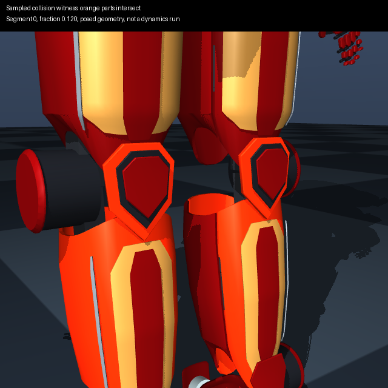

# Coordinated motion evidence

These are joint-space paths checked against exported visual triangles. All named
joints move together between successive waypoints. Angular spacing is at most
0.02 rad; linear spacing is at most 2 mm. Unspecified movable joints stay at zero.
Continuous angles are used literally, so a full revolution is not skipped.

| Path | Samples | Samples with intersections | Newly intersecting pairs during motion |
| --- | ---: | ---: | --- |
| [2-axis arm](01_arm_2dof_report.json) | 51 | 51 | None |
| [6-axis arm](02_arm_6dof_report.json) | 37 | 37 | None |
| [7-axis arm](03_arm_7dof_report.json) | 37 | 37 | None |
| [SCARA](04_scara_report.json) | 41 | 41 | None |
| [Mark 43 chest and neck](mark43_chest_neck_report.json) | 121 | 0 | None |
| [Mark 43 knees](mark43_knees_report.json) | 51 | 45 | Present |

Arm goals match the existing task-motion fixtures. Existing contacts include
housing panel edges, standoffs and joint hubs. This strict audit excludes only
direct parent-child pairs; fixed assemblies and neighbouring rigid bodies may
still appear. Reports preserve both the initial pairs and newly appearing pairs.
No initial pair is silently accepted. A passing MuJoCo motion test uses different
collision geometry/exclusions and does not negate these surface results.

The knee path bends both knees from 0 to -1 rad. Its first intersection occurs at
-0.12 rad between each knee cap and shin shell. The following is an actual posed
URDF render, with intersecting parts highlighted; no dynamics are simulated:



Reproduce all six reports from the repository root after installing `./python[geometry]`:

```bash
python scripts/check_motion_paths.py
python scripts/check_motion_paths.py --check
python scripts/render_motion_failure.py examples/14_iron_man_mark_43/robot.sim.urdf \
  docs/motion_paths/mark43_knees_report.json --output /tmp/knee-collision.png
```

`--check` recomputes and compares the evidence, including known failures; it does
not assert that these designs are collision-free. CI runs this comparison.

For your own design, supply a JSON array such as
`[{"joint_1":0,"joint_2":0},{"joint_1":0.3,"joint_2":-0.5}]`:

```bash
python scripts/audit_motion_path.py path/to/robot.urdf path/to/waypoints.json \
  --angular-step 0.02 --linear-step 0.002 --json /tmp/path-report.json
```

The command returns 1 for detected intersections and 2 for invalid input. Reports
include source hashes, the exact first failure and every failing sampled pose.
Invalid or inconsistent joint sets, nonfinite/out-of-range values, unsupported
mimic joints and paths exceeding 10,000 poses are rejected before sampling.

Finite sampling can miss collisions between samples. Triangle intersections do
not detect complete containment or prove clearance margins. These paths have no
timing and establish no balance, torque feasibility, human fit or hardware safety.
Use the compound collision, dynamics and wearer checks as separate evidence.
