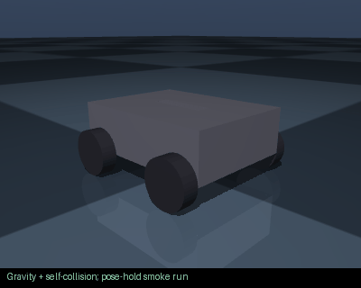

# four_wheel_robot

Prompt: Create a four-wheel robot




This GIF runs gravity, pose holding and self-collision on the shipped URDF. It is
not a learned policy or proof of hardware accuracy. The model's failures remain visible.

## Download and inspect

- [ROS 2 package](robot.ros2.zip), [training package](robot.training.zip), [URDF](robot.urdf), [robot JSON](robot.json), [BOM](BOM.md).
- [Simulation report](simulation_report.json): **6/6** checks;
  **0** initial penetration contacts.
- Failed checks: none in this smoke battery.

## MoveIt / ROS 2

No serial manipulator group applies to this example; MoveIt is not generated.
The ROS package includes display and control files. Wheeled navigation needs a
navigation controller; a gripper alone needs a gripper controller.

## Reproduce

From the repository root:

```bash
python scripts/audit_examples.py
python scripts/render_example_gifs.py
```

These are procedural concept models. Masses, motors and contacts are approximate;
manufacturing interfaces and measured dynamics remain unverified.
