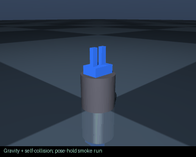

# parallel_gripper

Prompt: Create a two-finger parallel gripper




Collision model: **URDF primitives / mesh bounding boxes**.

This GIF runs gravity, pose holding and self-collision on the shipped model. It is
not a learned policy or proof of hardware accuracy. The model's failures remain visible.

## Download and inspect

- [CAD / STL / OpenSCAD](robot.cad.zip), [ROS 2 package](robot.ros2.zip), [training package](robot.training.zip), [URDF](robot.urdf), [robot JSON](robot.json), [BOM](BOM.md).
- [Simulation report](simulation_report.json): **5/5** checks;
  **0** initial penetration contacts.
- Failed checks: none in this smoke battery.
- [Physical build evidence and missing interfaces](BUILDABILITY.md), [machine-readable record](buildability_report.json). **No tested physical build is documented.**

## MoveIt / ROS 2

No serial manipulator group applies to this example; MoveIt is not generated.
The ROS package includes display and control files. Wheeled navigation needs a
navigation controller; a gripper alone needs a gripper controller.

## Reproduce

From the repository root:

```bash
node scripts/export_examples.ts
python scripts/audit_examples.py
python scripts/render_example_gifs.py
python scripts/document_examples.py
python scripts/verify_example_artifacts.py
```

These are procedural concept models. Masses, motors and contacts are approximate;
manufacturing interfaces and measured dynamics remain unverified.
