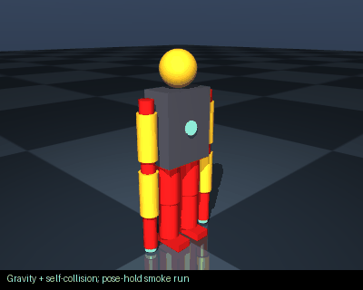

# battle_mech

Prompt: Create a humanoid battle mech with two 7 DOF arms, a head camera and an IMU




Collision model: **URDF primitives / mesh bounding boxes**.

This GIF runs gravity, pose holding and self-collision on the shipped model. It is
not a learned policy or proof of hardware accuracy. The model's failures remain visible.

## Download and inspect

- [CAD / STL / OpenSCAD](robot.cad.zip), [ROS 2 package](robot.ros2.zip), [training package](robot.training.zip), [URDF](robot.urdf), [robot JSON](robot.json), [BOM](BOM.md).
- [Simulation report](simulation_report.json): **4/6** checks;
  **0** initial penetration contacts.
- Failed checks: actuator_sweep, disturbance_recovery.
- [Physical build evidence and missing interfaces](BUILDABILITY.md), [machine-readable record](buildability_report.json). **No tested physical build is documented.**

## Design research

[Public engineering sources and model-specific changes](../../references/engineering/README.md).

## MoveIt / ROS 2

[Browse the generated MoveIt configuration](moveit/) (SRDF, KDL, OMPL, controllers).
Unzip the ROS package into a workspace's `src/` directory, then:

```bash
source /opt/ros/jazzy/setup.bash
rosdep install --from-paths src --ignore-src -r -y
colcon build
source install/setup.bash
ros2 launch battle_mech move_group.launch.py
```

The launch uses mock hardware. Planning requires a collision-free start state.
The fixed-root planner is not a walking controller or a simulation bridge.

## Reproduce

From the repository root:

```bash
node scripts/export_examples.ts
python scripts/audit_examples.py
python scripts/render_example_gifs.py
python scripts/document_examples.py
python scripts/verify_example_artifacts.py
```

These are procedural concept models. Masses, motors and contacts are approximate;
manufacturing interfaces and measured dynamics remain unverified.
