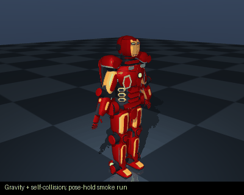
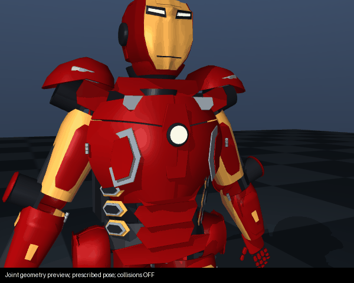

# iron_man_mark_43

Prompt: Build me a movie-accurate wearable Iron Man Mark 43 suit from Age of Ultron with all the small polygon armour plates that open and close, repulsors, a HUD and an IMU. Budget $60000




Collision model: **compound convex meshes and URDF primitives**.

This GIF runs gravity, pose holding and self-collision on the shipped model. It is
not a learned policy or proof of hardware accuracy. The model's failures remain visible.

## Download and inspect

- [CAD / STL / OpenSCAD](robot.cad.zip), [ROS 2 package](robot.ros2.zip), [training package](robot.training.zip), [URDF](robot.urdf), [robot JSON](robot.json), [BOM](BOM.md).
- [Simulation report](simulation_report.json): **4/6** checks;
  **0** initial penetration contacts.
- Failed checks: actuator_sweep, disturbance_recovery.
- [Physical build evidence and missing interfaces](BUILDABILITY.md), [machine-readable record](buildability_report.json). **No tested physical build is documented.**

## Design research

[Public engineering sources and model-specific changes](../../references/engineering/README.md).

## MoveIt / ROS 2

[Browse the generated MoveIt configuration](moveit/) (SRDF, KDL, OMPL, controllers).
Unzip the ROS package into a workspace's `src/` directory, then:

```bash
source /opt/ros/jazzy/setup.bash
rosdep install --from-paths src --ignore-src -r -y
colcon build
source install/setup.bash
ros2 launch iron_man_mark_43 move_group.launch.py
```

The launch uses mock hardware. Planning requires a collision-free start state.
The fixed-root planner is not a walking controller or a simulation bridge.

[Recorded MoveIt runtime result](moveit_report.json).

## Reproduce

From the repository root:

```bash
node scripts/export_examples.ts
python scripts/audit_examples.py
python scripts/render_example_gifs.py
python scripts/document_examples.py
python scripts/verify_example_artifacts.py
```

These are procedural concept models. Masses, motors and contacts are approximate;
manufacturing interfaces and measured dynamics remain unverified.

## Current armour and helmet animations


### Individual joint checks




These three close-ups prescribe joint positions on the exported meshes, with
collision resolution disabled. They verify the joint tree, not actuator forces
or safe motion. [Source-hashed articulation report](articulation_report.json).
Each finger has three flexion joints; each thumb has two. The neck has yaw and
pitch, and the chest inlays now move with their chest doors. Fixed trim is meant
to move with its supporting plate, not have an independent motor.


These two previews use a **fixed base and self-collision disabled** to show the
actuated geometry. They do not validate donning or motion clearance. The first
GIF and simulation report above use self-collision enabled.

[MoveIt runtime result](moveit_report.json): controllers and planning scene start,
with a collision-free neutral state. Small neck and left/right arm goals plan and
execute through mock control; this does not validate the whole motion range or
real motors. [Left arm](moveit_left_arm_report.json), [right arm](moveit_right_arm_report.json).
An initial five-second right-arm request [timed out](moveit_right_arm_timeout.json)
while other audits were running; a subsequent request succeeded. This is not a
planning reliability benchmark. [Wearer fit](wearability_report.json)
also fails. [Production references and downloaded design research](../../references/mark43/RESEARCH.md)
record the sources and limitations. [Visual comparison](../../docs/MARK43_VISUAL_REVIEW.md).

The current revision separates helmet seams and adds the red forehead insert,
reshapes shoulders and boot uppers, and cuts limb-shell ends around joint motors.
Surface-following boot/forearm trim replaces intersecting badges. Rear details
follow their flight flaps. Internal struts have clearance at their connector ends.

[Surface-contact comparison](surface_contact_comparison.json): **81 → 0**
non-adjacent intersecting pairs at neutral. No new neutral pairs were introduced.
This tests visual triangle surfaces with tessellated primitives; it is not a
penetration-depth, full-containment or wearer-fit measurement.
[86 sampled poses](surface_contact_report.json) still expose shoulder, side-door,
chin and other motion failures. Zero neutral contacts is not full articulation approval.

The main physics GIF and smoke report use the source-checked compound collision
archive, with self-collision enabled. The old box approximation fills hollow armour
and creates false collisions; its diagnostic remains in [clearance_report.json](clearance_report.json)
for comparison. Compound hulls are still approximations; their errors are reported.
