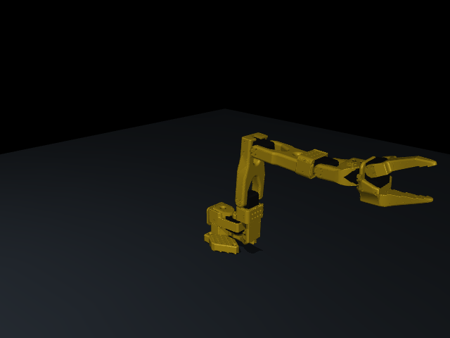

# Hugging Face SO-101 reference



This reference imports the six-axis SO-101 model from the Hugging Face Hub, with
13 CAD-derived STL meshes, explicit link inertias, position actuators, force limits
and joint ranges. It is separate from the 17 procedurally generated concepts.
The web generator does **not** yet convert arbitrary prompts into this hardware.

## Download and run

From the repository root, using Python 3.10+:

```bash
python -m pip install ./python
python scripts/benchmark_hf_so101.py --gif
# After the first download, require verified local assets and no network:
python scripts/benchmark_hf_so101.py --offline --gif
```

The downloader uses the public Hub without a token. It pins
[`namenu/so101-pick-place-env`](https://huggingface.co/namenu/so101-pick-place-env/tree/67f6cb7676cba923c7389b2aaf298c4fd0c07b4d)
at commit `67f6cb7676cba923c7389b2aaf298c4fd0c07b4d`, checks each file's size and
SHA-256 against [the lock file](../../python/ttr_hf/so101.lock.json), and downloads
only model data, the source README and licensing notices. It executes no remote
Python code. Assets occupy about 16 MB in `cache/`, excluded from Git.
`--output /tmp/so101-review` keeps a new run separate from this published report.
Headless rendering defaults to EGL; use `MUJOCO_GL=osmesa` if your system supports
OSMesa instead. Rendering requires the corresponding system graphics libraries.

## What was measured

The [recorded benchmark](benchmark.json) uses 32 seeds, 1000–1031, and a 2-second
maximum episode. It commands modest ±0.25 rad perturbations around the initial
joint pose. Success requires all six joint errors below 0.05 rad and joint speeds
below 0.1 rad/s, with contact penetration below 1 mm, for five consecutive control
steps. Control runs at 20 Hz; physics runs at 500 Hz with gravity enabled.

| Controller | Successful episodes | Mean final maximum joint error |
|---|---:|---:|
| Hold initial position | 0/32 | 0.2092 rad |
| Command goal to upstream position servos | 32/32 | 0.00053 rad |
| Local PPO, 8,192 training steps, seed 0 | 0/32 | 0.4687 rad |

The GIF shows the position-servo rollout for seed 1000. The successful controller
is a direct joint-position command, **not a learned manipulation policy**.
The PPO result is a failed learning baseline, preserved in the report.
A trial does not establish full-workspace collision freedom or payload capacity.

## Training contract

```bash
python -m pip install './python[train]'
python scripts/benchmark_hf_so101.py --offline --train-steps 8192 --output /tmp/so101-training
```

This trains locally on CPU and evaluates separate fixed seeds against the two
baselines. It writes a checkpoint and measured results; it never uploads data or
starts paid Hugging Face Jobs. Install the package before importing directly:

```python
from ttr_hf.assets import fetch_assets
from ttr_hf.env import SO101JointEnv

env = SO101JointEnv(fetch_assets('references/so101/cache'))
observation, info = env.reset(seed=0)
# Observation: six joint positions, six velocities, six target positions.
# Absolute RADIAN position commands, in the order below:
# shoulder_pan, shoulder_lift, elbow_flex, wrist_flex, wrist_roll, gripper
observation, reward, terminated, truncated, info = env.step(env.goal)
env.close()
```

This is a Gymnasium state-based positioning task. It is **not** a drop-in camera
or action interface for LeRobot policies. Physical LeRobot devices need their own
motor calibration and configured normalization; do not send these radian arrays
to a real motor bus. No hardware driver is invoked by this benchmark.

## Actual fabrication and LeRobot

The Hub model credits [The Robot Studio SO-ARM100/SO-101](https://github.com/TheRobotStudio/SO-ARM100)
for the robot geometry. Use that project's BOM and printable manufacturing parts,
then follow [Hugging Face's SO-101 assembly and calibration guide](https://huggingface.co/docs/lerobot/main/en/so101).
Simulation STL assets include motors and assembled geometry; they are **not** a
complete print-and-assemble kit. This repository has not built a physical SO-101.

The source environment's pick-and-place task attaches a nearby cube to the tool
when the gripper closes. We do not import that task or its assisted-grasp logic.
Our environment retains the source's convex-mesh collision approximation and
estimated servo dynamics. It adds a floor at −3 mm, gravity, lighting and an
explicit timestep, without altering the supplied inertias or controller gains.
There is no measured friction, backlash, temperature or real-hardware transfer
validation. The source XML describes servo-gain assumptions and calibration offsets.

The imported assets are Apache-2.0; `cache/LICENSE` and `cache/NOTICE` accompany
all downloads. The environment and downloader in this repository are our code.
This reference does not validate Mark 43, human wearability, or other generated robots.
